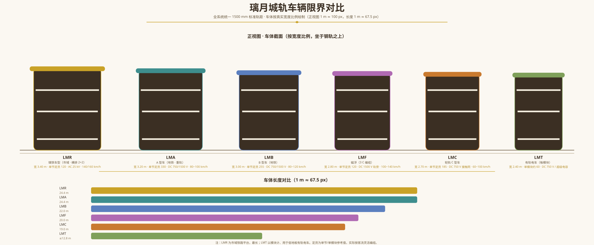
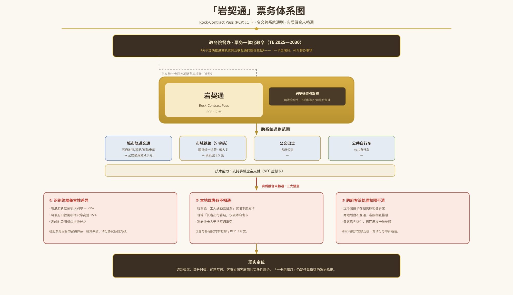
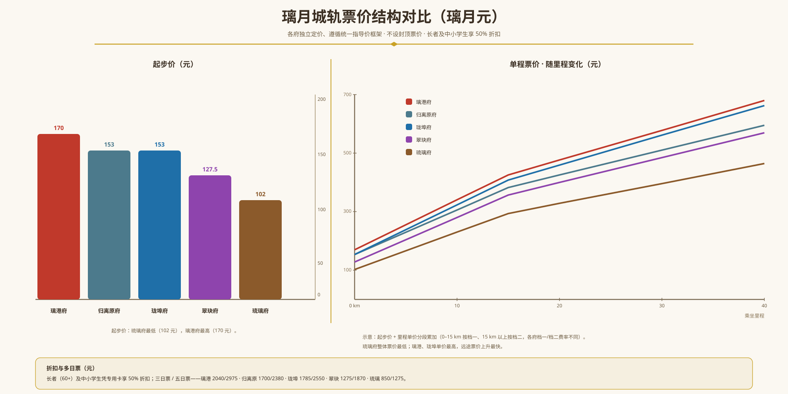
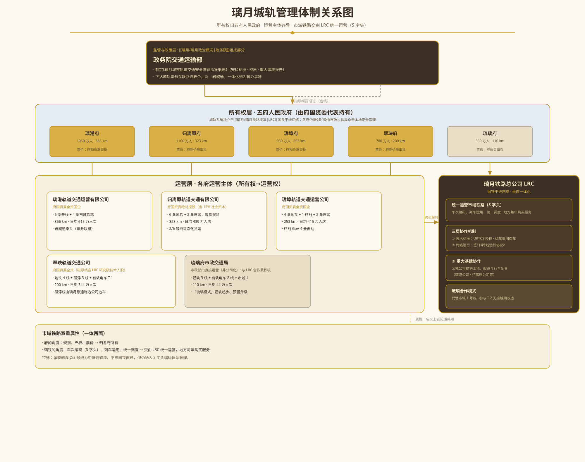

> **货币说明**：璃月中央银行发行的**璃月元**（MCY，1 [摩拉](./璃月经济与产业概况.md) $\approx$ 0.85 璃月元）为璃月法定货币。[摩拉](./璃月经济与产业概况.md)仍作为国际储备资产及大宗商品结算的核心媒介继续流通。本文档中的票价、运费均以璃月元计。

## 简介

璃月共和国的城市轨道交通系统由五府地方政府分别规划与投资，产权归属于各府轨道交通公司或市政运输局，独立于[璃月铁路总公司](./璃月铁路概况.md)（[LRC](./璃月铁路概况.md)）的国铁干线网络。城轨系统承担五府城区内部及近郊卫星城的大运量客运任务，由地铁（或轻轨、有轨电车）与市域铁路两个层次功能互补——前者覆盖城区内部高频短途出行，后者连接主城与远郊县市。市域铁路归各府相关单位所有，但一般交由国铁统一运营：在璃铁管理口径下，其车次编为 **S 字头**、纳入[璃月铁路](./璃月铁路概况.md)统一管理，地方每年向璃铁购买服务——市域铁路与 S 字头是一体两面，前者是府的管理角度（规划、产权、票价），后者是璃铁的管理角度（车次编码、列车运用、统一调度）。

截至 TE 2030 年，五大府均建成规模不等的城市轨道交通网络，总运营里程合计约 1252 km，日客运总量约 1857 万人次。

| 府    |   人口   | 系统类型                  |  运营里程  |  日均客流量  |
| :--- | :----: | :-------------------- | :----: | :-----: |
| 璃港府  | 1050 万 | 地铁 + 市域铁路             | 366 km | 615 万人次 |
| 归离原府 | 1160 万 | 地铁 + 市域铁路             | 323 km | 439 万人次 |
| 珑埠府  | 930 万  | 地铁 + 市域铁路             | 253 km | 415 万人次 |
| 翠玦府  | 700 万  | 地铁 + 磁浮（含市域）+ 有轨电车 | 200 km | 344 万人次 |
| 琉璃府  | 360 万  | 轻轨 + 有轨电车 + 市域铁路      | 110 km | 44 万人次  |

## 璃港府轨道交通

璃港府轨道交通系统 (Liyue Harbor Metro, LHM) 由**璃港轨道交通运营有限公司**运营，该公司为璃港府国资委全资控股的城市公共服务企业。系统于 TE 2008 年 1 月 14 日（铁道节当日）开通首条试验段，历经二十余年发展，已形成 **6 条普线 + 4 条市域铁路**的网络格局。

### 线路一览

| 线路 | 识别色 | 起讫站 | 长度 | 车站数 | 开通年份 | 供电制式 | 编组 |
|:----|:-----|:------|:---:|:-----:|:-------:|:--------|:----|
| 1 号线 | 赤红 | 南部老城 — 北部政务区 | 26 km | 21 | 2008 | DC 750 V 第三轨 | 6 B |
| 2 号线 | 天蓝 | 璃港北站 — 海港码头 | 31 km | 24 | 2010 | DC 750 V 第三轨 | 6 B |
| 3 号线 | 翠绿 | 西部城区 — 东部滨河区 | 38 km | 28 | 2012 | DC 1500 V 接触网 | 6 A |
| 4 号线 | 琥珀 | 中心广场 — 东部商区 | 22 km | 17 | 2014 | DC 1500 V 接触网 | 6 A |
| 5 号线 | 绀紫 | 西部郊区 — 东部新港区 | 44 km | 32 | 2016 | DC 1500 V 接触网 | 6 B |
| 6 号线 | 金橙 | 北部远郊新城 — 东北居住区 | 35 km | 26 | 2019 | DC 1500 V 接触网 | 6 B |

**1 号线**为璃港最早的骨干线路，连接南部老城商业中心与北部政务区，全程地下敷设。途径东部商区（换乘 4 号线）、中心政务区（换乘 2 号线）、璃港北站（换乘国铁 G/Z 字头及市域 4 号线）。日均客流量约 120 万人次，为全网最繁忙线路。供电采用 DC 750 V 第三轨，与国铁市域线保持物理隔离。

**2 号线**南北纵贯，串联璃港北站（国铁枢纽）、CBD 中央商务区与海港码头轮渡中心。在中心政务区站与 1 号线形成双线同台换乘，站内设有集商业、餐饮为一体的大型地下街「岩巷」。与 1 号线同为早期 DC 750 V 第三轨线路，第三轨铺设在远离站台侧的隧道壁，以降低乘客误触风险。

**3 号线**为西南—东北走向，穿越西部城区的新城开发区，沿东部滨河区河岸高架敷设。该线是璃港首条采用 DC 1500 V 接触网供电的线路，较早期第三轨线路具备更好的供电能力和延伸条件。部分区间采用全封闭声屏障，减少对河岸生态保护区的影响。

**4 号线**是一条东西向的加密线，连接中心广场与东部商区，全线仅 22 km 但站间距极小（平均 1.3 km），专为解决老城区核心区的短距出行需求。

**5 号线**是全网最长线路，西起西部远郊的居住区，东至东部新港区开发区，线路在中心广场设站，与 4 号线换乘。为应对西郊方向的通勤潮汐客流，在西部郊区段设有双侧站台，早高峰可执行大小交路越行模式。

**6 号线**连接北部远郊新城和东北居住区两大新兴居住组团，全线多为高架段，设有 3 座 P+R 停车场，每座均配备电动车快充桩和电动自行车集中停放棚。

### 市域铁路

| 线路 | 起讫站 | 长度 | 车站数 | 最高速度 | 停站模式 | 编组 |
|:----|:------|:---:|:-----:|:-------:|:--------|:----|
| 市域 4 号线（科智快线） | 璃港北站 — 西部科技园区 | 35 km | 6 | 140 km/h | 大站快车 | 4/8 LMR |
| 市域 1 号线 | 璃港北站 — 国际机场 — 东部新港 | 38 km | 7 | 160 km/h | 站站停 / 大站快车 / 直达 | 4/8 LMR |
| 市域 2 号线 | 南部老城 — 北部远郊新城 — 东北郡方向 | 45 km | 10 | 140 km/h | 站站停 / 大站快车 | 4/8 LMR |
| 市域 3 号线 | 中心广场 — 西部新城 — 西北郡方向 | 52 km | 11 | 140 km/h | 站站停 | 4/8 LMR |

**市域 1 号线（机场线）**是璃港府的窗口线路。**站站停**模式每站皆停、全程约 35 min；**大站快车**仅停靠璃港北站、机场、东部新港三站，约 22 min；**直达列车**中途不停，18 min 即从璃港北站抵达国际机场站。机场站设地下值机大厅，直达列车乘客可在车站办理行李托运、获取登机牌，到机场后直接过安检。

**市域 2 号线**沿东郊城市开发走廊敷设，连接北部远郊新城与东北郡方向的产业转移承接区。该线在南部老城站与 1 号线、4 号线换乘，实现市域客流向市中心核心区的快速疏解。

**市域 3 号线**翻越西部山岭，是唯一需穿越山岭的市域线，全线隧道群总长 9 km。列车配备气压调节系统，以缓解隧道内的气压波动对乘客耳膜的影响。

**市域 4 号线（科智快线）**是一条连接璃港北站（国铁枢纽）与西部科技园区的大站快车线路，采用 AC 25 kV 供电制式，可直通进入国铁线路区段运行。列车最高运营速度 140 km/h，35 km 全程约 20 min，中途仅停靠西部城区、科技园的四站。西部科技园区是璃港府近年来重点打造的高新产业园区，该线的开通为居住在主城区的科技从业者提供了快速通勤通道。

### 车站特色

- **璃港北站**：全网最大的换乘枢纽，1 号线、2 号线、市域 4 号线、市域 1 号线与国铁 G 字头、Z 字头、S 字头在此交汇。站厅层面积达 6.8 万平方米，设有 12 组进出站闸机，日均换乘客流超过 60 万人次。站内设有「千岩安全文化展厅」常设展。
- **南部老城站**：1 号线最早开通的车站之一，位于璃月港最繁华的商业步行街地下。站台层直接连通各大商场地下层，出站即达。站内装饰采用仿明清砖雕风格，还原老城街区风貌。
- **中心广场站**：4 号线与 5 号线的换乘站，位于中心广场大型城市综合体地下，设有三层岛式站台。站厅艺术墙刻有长篇浮雕长卷，长约 80 米，为璃月城轨系统的标志性公共艺术作品。

## 归离原府轨道交通

归离原府轨道交通系统 (Guliyuan Metro, GYM) 由**归离原轨道交通有限公司**运营。作为璃月人口最多的府（1160 万）和最大的工业基地，归离原府的城轨系统以「重轨为主、客货兼容」为设计起点，但这一定位在运营实践中经历了调整。

### 线路一览

| 线路   | 识别色 | 起讫站            |  长度   |      车站数      | 开通年份 | 供电制式          | 编组 |
| :--- | :-- | :------------- | :---: | :-----------: | :--: | :------------ | :-- |
| 1 号线 | 钢青  | 南部工业区 — 归离原站   | 28 km |      22       | 2009 | DC 750 V 第三轨  | 6 A |
| 2 号线 | 铁灰  | 南部远郊 — 东部工业区   | 52 km | 36（含 6 个货运车站） | 2013 | DC 1500 V 接触网 | 6 A |
| 3 号线 | 焰红  | 归离原南站 — 北部物流园区 | 36 km |      27       | 2015 | DC 1500 V 接触网 | 6 A |
| 4 号线 | 墨蓝  | 东部新城 — 西部工业区   | 44 km |      31       | 2018 | DC 1500 V 接触网 | 6 B |
| 5 号线 | 棕褐  | 归离原西站 — 西部矿区入口 | 55 km |      24       | 2021 | DC 1500 V 接触网 | 6 B |
| 6 号线 | 浅灰  | 东部工业区 — 内河港口北  | 25 km |       8       | 2017 | DC 1500 V 接触网 | 6 A |

**1 号线**为归离原最早开通的线路，连接南部居住区与归离原站（国铁枢纽），沿南部工业大道敷设。由于工业大道沿线工厂密集，早高峰客流以工人向市区的反向通勤为特色——该线是全国少数早高峰下行方向更为拥挤的线路之一。因建设年代较早，供电采用 DC 750 V 第三轨。

**2 号线**是归离原府轨道交通的脊梁，建设时按重载城轨标准设计——列车编组采用 6 节 A 型车，单列定员 1980 人，线路桥梁和隧道结构均按货运轴重进行了加固。运营上采用客货混跑模式：**高峰时段 (7:00—9:00、17:00—19:00)** 纯客运运营，最大程度保障通勤运力；**高峰外时段**则在客运班次之间见缝插针地开行货运列车，大致每 1~2 趟客运后穿插 1 趟货运。其中，集装箱列车由专为城轨客货混跑研制的 QYD 2-D 城轨货运版直流电力机车牵引运营（一列可拉 16 个标准集装箱），行包列车则由地铁车厢直接装配运输。除沿线客运车站外，2 号线另设有若干专用货运车站，处理大规模的货物装卸与转运；客运大站亦具备小规模行包装卸能力。规划的货运专线将主要连接沿线工厂、批发市场和商业中心，重载设计储备为远期进一步扩能留有余地。

**3 号线**连接归离原南站（国铁普速枢纽）与北部物流园区，全线近半数车站设有与物流园的直通通道。该线目前着重于提升行包列车运力——行包列车因深受快递商喜爱而持续涨价，但集装箱列车对其吸引力不足且亏损，集装箱运营规划已搁置。

**4 号线**为东西向骨干线，串联东部新城、大学城、市中心商业区与西部工业区居住区，日均客流量约 90 万人次。

**5 号线**连接归离原西站（国铁高铁枢纽）与西部矿区入口处的居住区，是归离原府向西拓展的重要基础设施。该线在终点站设有大型 P+R 停车场，新能源汽车充电区和电动自行车停放区各占一半，并提供共享电动自行车换电服务。

**6 号线**连接东部工业区与内河港口北，兼顾东部工业走廊的城市客运功能。列车 6 节 A 型车编组，已像 2 号线一样开通了常态化货运列车。

### 市域铁路

| 线路 | 起讫站 | 长度 | 车站数 | 最高速度 | 编组 |
|:----|:------|:---:|:-----:|:-------:|:----|
| 市域 1 号线 | 归离原西站 — 北工业区 — 北部新城 | 48 km | 9 | 140 km/h | 4/8 LMR |
| 市域 2 号线 | 归离原站 — 东部内河港 — 北部物流园 | 35 km | 7 | 140 km/h | 4/8 LMR |

**市域 1 号线**沿北部工业走廊延伸，连接归离原西站（国铁高铁枢纽）、北工业园区与北部新城。早高峰最小发车间隔 4 min，为沿线工业工人提供快速通勤服务。

**市域 2 号线**经东部内河港，在客运之外兼顾港口接驳功能——夜间时段按需开行港口货运班列，运输集装箱和散货往返内河港与归离原南站编组场。

### 车站特色

- **归离原站**：1 号线与 4 号线的换乘枢纽，车站北广场与国铁归离原站的站前广场融为一体。站厅层设有「归离原工业发展史」常设展，展陈归离原从农耕社会到重工业基地的百年变迁实物与模型。
- **南部工业区站**：1 号线终点站，设有大型非机动车停车场，周边工厂工人通勤以电动车换乘地铁为主。该站早高峰 06:30—08:00 限流常态化，站外设有防雨防晒的排队棚架。

### 货运定价

归离原地铁货运按品类实行差异化定价，各品类计价方式与目标客群各有侧重：

- **集装箱**：102 璃月元/TEU/km，最低 10 km；装卸费 2125 璃月元/TEU。面向工厂大批量货物运输，可在 2 号线、6 号线沿线专用货运车站办理整箱到发。
- **行包快递**：首重 5 kg、170 璃月元，续重 20.4 璃月元/kg；急件上浮 50%。主要服务电商快递和物流园商户，行包列车在 3 号线物流园站设有专用装卸通道，可实现站台到仓库的短驳衔接。
- **散货大宗**：10.2 璃月元/t/km，最低 20 t；协议价可能更低。适用于建材、矿石等大宗散货，由 2 号线散货专列运输，可与内河港口铁路专用线对接。

货运列车仅在非客运时段（平峰/夜间）开行，货运车站与客运站物理隔离，货运编组不经过安检门区域。

## 珑埠府轨道交通

珑埠府轨道交通系统 (Longbu Metro, LBM) 由**珑埠轨道交通运营公司**运营。珑埠府作为璃月北部经济副中心和第二大港口城市（930 万人口），其城轨系统以「港城一体、南北贯通」为规划理念，目前已建成 4 条地铁 + 1 条环线 + 2 条市域铁路。

### 线路一览

| 线路 | 识别色 | 起讫站 | 长度 | 车站数 | 开通年份 | 供电制式 | 编组 |
|:----|:-----|:------|:---:|:-----:|:-------:|:--------|:----|
| 1 号线 | 海蓝 | 珑埠南站 — 港区 | 33 km | 25 | 2011 | DC 1500 V 接触网 | 6 B |
| 2 号线 | 草绿 | 东部滨海新城 — 珑埠西站 | 38 km | 28 | 2014 | DC 750 V 第三轨 | 6 B |
| 3 号线 | 浅紫 | 西南郊区方向 — 南部新城区 | 42 km | 30 | 2017 | DC 1500 V 接触网 | 6 A |
| 4 号线 | 珊瑚 | 珑埠东站 — 东部自贸区 | 30 km | 20 | 2020 | DC 1500 V 接触网 | 6 A |
| 环线 | 米白 | 环路沿线（闭合环） | 42 km | 34 | 2023 | DC 1500 V 接触网 | 4/6 B |

**1 号线**为南北骨干线，纵贯珑埠主城区，连接珑埠南站（国铁高铁枢纽）、CBD、珑埠港客运码头和港区工业区。采用 DC 1500 V 接触网供电，与同期规划的国铁市域线接口兼容。该线在港口段末端岔出专线接入珑埠集装箱码头内部，夜间时段以货运为主的市域铁路列车可通过专线直接驶入港区装卸。

**2 号线**东西走向，连接东部滨海新城与珑埠西站（国铁普速枢纽），沿线经过大学城和北部风景区。该线是珑埠唯一采用 DC 750 V 第三轨供电的线路，地上高架段可眺望海景，被称为珑埠的「景观观光线」。

**3 号线**连接西南郊区方向与南部新城区的新兴居住区，全线多为地下段，标准站设计采用统一的「海浪波纹」天花板装饰。

**4 号线**连接珑埠东站（国铁客货混运枢纽）与东部自贸区，客流量以商务和物流从业者为主，设有专门的大件行李存放区。

**环线**串联主城区外围各新城组团，与 1~4 号线均有换乘站。全线采用无人驾驶技术（GoA 4 等级），是璃月首条全自动运行地铁线路。列车采用 4/6 B 混跑编组。

### 市域铁路

| 线路 | 起讫站 | 长度 | 车站数 | 最高速度 | 停站模式 | 编组 |
|:----|:------|:---:|:-----:|:-------:|:--------|:----|
| 市域 1 号线 | 珑埠南站 — 珑埠机场 — 东部新港 | 28 km | 6 | 160 km/h | 站站停 / 大站快车 / 直达 | 4/8 LMR |
| 市域 2 号线 | 珑埠西站 — 西南郊区方向 — 北部风景区 | 40 km | 8 | 140 km/h | 站站停 / 大站快车 | 4/8 LMR |

**市域 1 号线（机场线）**连接高铁站、机场与东部新区。**直达列车**在珑埠南站与机场站之间一站直达，15 min 完成全程；**大站快车**增停东部新港站，18 min；**站站停**全程 24 min。机场站设有空侧值机柜台。

**市域 2 号线**沿西南郊区方向延伸至北部风景区，设一座观景高架站，站台两侧无屏蔽门，乘客在站台即可远眺周边自然景观。

### 车站特色

- **珑埠南站**：1 号线始发站，与国铁珑埠南站（9 台 18 线高铁枢纽）立体换乘，地下三层为城轨站台，地下二层为国铁出站通道，地下一层为换乘大厅。日换乘客流约 40 万人次。
- **珑埠港站**：1 号线唯一的地上高架站，设有全封闭声屏障，站台直接架设在珑埠港客运码头的候船大厅屋顶。乘客可在同一建筑内完成轨道—轮渡的换乘。

## 翠玦府轨道交通

翠玦府轨道交通系统 (Cuijue Transit, CJT) 由**翠玦轨道交通公司**运营。翠玦府（700 万人口）作为璃月的高新科技中心，其城轨系统以「地铁为骨、磁浮为翼」为定位：四条地铁线构成市中心十字骨架与加密网络，一条磁浮线作为技术验证与中低运量补充，两条磁浮线承担市域铁路功能，连接郊区枢纽与新城；另有一条有轨电车环线服务老城区。

### 线路一览

| 线路 | 识别色 | 起讫站 | 长度 | 车站数 | 开通年份 | 供电制式 | 编组 |
|:----|:-----|:------|:---:|:-----:|:-------:|:--------|:----|
| 地铁 1 号线 | 朱红 | 翠玦西站 — 翠玦站 — 翠玦东站 | 26 km | 18 | 2021 | DC 1500 V 接触网 | 4/6 A（预留 8 A） |
| 地铁 2 号线 | 橙黄 | 南部商业区 — 翠玦站 — 北部科学新城 | 22 km | 16 | 2023 | DC 1500 V 接触网 | 4/6 A（预留 8 A） |
| 地铁 3 号线 | 绛紫 | 西南居住区 — 中心商业区 — 北部政务区 | 22 km | 16 | 2030 | DC 1500 V 接触网 | 4/6 A（预留 8 A） |
| 地铁 4 号线 | 青碧 | 南部商业区 — 东部办公区 — 翠玦东站 | 20 km | 15 | 2029 | DC 1500 V 接触网 | 4/6 A（预留 8 A） |
| 磁浮 1 号线 | 虹彩 | 翠玦站 — 轨道研究院 | 18 km | 6 | 2024 | DC 1500 V 轨旁供电轨 | 3 C |
| 有轨电车 T 1 | 石英白 | 老城环线 | 17 km | 24 | 2012 | DC 750 V 接触网 | 4 模块 |

**地铁 1 号线**为东西向骨干线，连接翠玦西站（国铁高铁枢纽）、翠玦站（国铁普速枢纽）与翠玦东站（国铁混合枢纽），串联三大铁路枢纽。线路横贯市中心核心区，全程地下敷设，站间距约 1.5 km。与地铁 2 号线在翠玦站形成十字换乘，构成翠玦城轨的「十字骨架」。列车采用 4/6 节 A 型车混跑（土建预留 8 A），DC 1500 V 接触网供电。

**地铁 2 号线**为南北向骨干线，南起南部商业区，经翠玦站（与 1 号线十字换乘）向北延伸至北部科学新城。该线串联商业区、市中心与科学城，是翠玦府「南商北科」城市格局的交通脊梁。列车配备千兆车载 Wi-Fi 和无线充电座，是璃月首条全线覆盖 5 G 虚空信号的城轨线路。采用 4/6 节 A 型车混跑（土建预留 8 A）。

**地铁 3 号线**为 L 型加密短线（GoA 4 全自动运行），自西南居住区出发，经中心商业区折向北部政务区。该线全程地下敷设，采用全自动无人驾驶技术（GoA 4 等级），是翠玦第二条全自动运行地铁线路。列车 4/6 节 A 型车混跑（土建预留 8 A），最小发车间隔 90 s。线路长约 22 km，设 16 站，主要服务西南方向居住组团与市中心办公区之间的通勤潮汐客流。

**地铁 4 号线**为 L 型加密短线（GoA 4 全自动运行），自南部商业区出发，经东部办公区到达翠玦东站。该线串联商业核心区、政务办公组团与东部铁路枢纽，亦采用 GoA 4 全自动无人驾驶技术，与地铁 3 号线共同构成市中心高密度加密网络。列车 4/6 节 A 型车混跑（土建预留 8 A）。

**磁浮 1 号线**是璃月首条磁浮线路，定位为技术验证与示范运营。线路从翠玦站出发，经测试中心抵达轨道研究院，全程 18 km。列车 3 节编组（等同 3 C），通过电磁力悬浮于轨道上方 8 mm，运行噪音低于 60 dB(A)。该线为半自动驾驶 (GoA 2)，商业运营速度 100 km/h。磁浮线采用 DC 1500 V 轨旁供电轨，由[璃月铁路总公司](./璃月铁路概况.md)铁路研究院磁悬浮技术研究所与翠玦轨道交通公司合作建设运营，列车由璃月悬运制造公司生产。

**有轨电车 T 1 线**为老城区的环状有轨电车，地面敷设，与市政道路平面共线。车辆采用 4 模块 100% 低地板有轨电车，DC 750 V 接触网供电。该线主要服务老城区的短距出行和游客游览。

### 市域铁路

翠玦府的市域铁路采用**中低速常导磁浮**技术，由[璃月铁路总公司](./璃月铁路概况.md)铁路研究院磁悬浮技术研究所与翠玦轨道交通公司合作建设运营，纳入国铁 S 字头编码体系管理；因属磁浮制式，不与国铁轮轨系统直通运行，供电与信号独立设置。

| 线路 | 起讫站 | 长度 | 车站数 | 最高速度 | 自动驾驶等级 |
|:----|:------|:---:|:-----:|:-------:|:-----------:|
| 磁浮 2 号线 | 西南新区 — 翠玦西站 — 西北科技园 | 33 km | 6 | 140 km/h | GoA 4 |
| 磁浮 3 号线 | 翠玦东北机场 — 翠玦东站 — 东南产业园 | 42 km | 8 | 140 km/h | GoA 4 |

**磁浮 2 号线**连接西南新区、翠玦西站（国铁高铁枢纽）与西北科技园，土建预留 6 LMF，实际运营 4 节磁浮编组，全自动运行，最小发车间隔 3 min。该线服务于郊区低密度科技产业带与高铁枢纽之间的快速连接，与地铁的城区密集覆盖功能形成互补。改进型磁浮悬浮系统使商业运营速度提升至 140 km/h。远期规划继续向北延伸，打造面向游客的磁浮观光线。

**磁浮 3 号线**连接翠玦东北机场、翠玦东站（国铁混合枢纽）与东南产业园，土建预留 6 LMF，实际运营 4 节磁浮编组，亦为全自动运行。该线是为连接远郊机场与产业园区而设的快速走廊，与 1 号线在地铁翠玦东站设有换乘通道，实现城轨—市域铁路—国铁的三网衔接。

### 车站特色

- **翠玦站**：地铁 1 号线与 2 号线在此形成十字换乘枢纽，同时接驳磁浮 1 号线。站厅分为「常规地铁区」和「磁浮体验区」两部分。磁浮站台设有玻璃幕墙隔断，乘客可透过玻璃看到轨道上的磁浮线圈和列车悬浮状态，现场配有交互式科普展板——该站被中小学生誉为「行走的物理课堂」。
- **轨道研究院站**：磁浮 1 号线终点站，站厅与铁路研究院的展示大厅直连，设有常设的「下一代列车技术」互动展览，包括 LR 320 高速动车组的全尺寸模型展示和磁浮技术[展望](../国际/双边关系/璃月—蒙德关系.md)沙盘。
- **翠玦东站**：地铁 1 号线与 4 号线的换乘站，同时接驳磁浮 3 号线，实现城轨与市域铁路的同站换乘。车站与国铁翠玦东站（高速场 4 台 10 线、普速场 4 台 10 线）立体衔接，是翠玦府东部的综合交通枢纽。

## 琉璃府轨道交通

琉璃府轨道交通系统 (Liuli Transit, LLT) 由**琉璃府市政交通局**运营。琉璃府（360 万人口）作为璃月西部的资源与初加工中心、低端工业承接区，城轨规模虽小但功能分工明确：三条轻轨线面向市中心办公、商业与交通枢纽，两条有轨电车线作为外围住宅组团与轻轨枢纽之间的接驳，另有一条由废弃铁路改造而来的市域铁路。

### 线路一览

| 线路 | 识别色 | 起讫站 | 长度 | 车站数 | 开通年份 | 供电制式 | 编组 |
|:----|:-----|:------|:---:|:-----:|:-------:|:--------|:----|
| 轻轨 L 1 | 矿褐 | 琉璃站 — 西部矿区 | 18 km | 12 | 2015 | DC 750 V 接触网 | 6 C |
| 轻轨 L 2 | 琥珀金 | 琉璃东站 — 中心广场 | 20 km | 14 | 2018 | DC 750 V 接触网 | 4/6 C 混跑 |
| 轻轨 L 环线 | 碧蓝 | 琉璃东站 — 北部居住区（东北段） | 15 km | 12 | 2030 | DC 750 V 接触网 | 预留 6 C/近期 4 C |
| 有轨电车 T 1 | 石灰白 | 老城环线 | 15 km | 20 | 2013 | DC 750 V 接触网 | 3 编组 |
| 有轨电车 T 2 | 砂岩黄 | 东部城区 — 文化中心 | 12 km | 16 | 2020（2024 改造） | DC 750 V 超级电容 | 4 编组 |

**T 2 线**于 2024 年完成无接触网化改造。

**L 1 线**（轻轨）连接琉璃站（国铁普速枢纽）与西部矿区，是琉璃府客运量最大的线路。该线以市中心办公区、商业区和交通枢纽为核心服务对象，采用 DC 750 V 接触网供电。列车 6 节 C 型车编组。

**L 2 线**（轻轨）连接琉璃东站（国铁货运枢纽）与中心广场商业区，同样以面向市中心的办公、商业客流为主，沿线经过陶瓷产业园（承接归离原转移的低端陶瓷产能）和石珀加工市场。列车采用 4/6 节 C 型车混跑编组。

**L 环线**是琉璃府的外围轻轨环线，规划全环约 45 km，目前东北段（琉璃东站—北部居住区，15 km）已开通运营。该段串联东部商贸区、东北居住组团与北部产业区，填补了琉璃府东北方向的城市轨交空白。列车近期 4 节 C 型车编组（土建预留 6 C），DC 750 V 接触网供电。剩余西段和南段将随城市拓展分批建设。

**T 1 线**（有轨电车）服务于老城区及外围住宅组团，是老城区的传统有轨电车，地面混合路权，DC 750 V 接触网供电。车辆采用 3 编组有轨电车运行。该线重点衔接外围居住区与 L 1/L 2 轻轨枢纽，提供「最后一公里」接驳服务。全线保留早年的复古站台风格，是琉璃府的城市名片之一。

**T 2 线**（有轨电车）连接东部城区居住组团与文化中心，功能定位与编组方式均与 T 1 相似——4 编组有轨电车，作为外围住宅组团与轻轨枢纽之间的接驳线。2020 年初期仍采用传统 DC 750 V 接触网供电，于 2024 年完成无接触网化改造——全线拆除接触网，依靠车载大容量超级电容与锂钛电池包储能运行，进站停靠时利用 30 秒停站时间完成快速补电。若试验成功，该技术将推广至 T 1 线和全市公交系统。在琉璃有轨电车 T 2 的示范下，各府推动了有轨电车改超级电容的进程，力争于 2028～2036 分别改造完毕。

### 市域铁路

| 线路      | 起讫站                 |  长度   | 车站数 |   最高速度   | 编组    | 说明                      |
| :------ | :------------------ | :---: | :-: | :------: | :---- | :---------------------- |
| 市域 1 号线 | 琉璃站 — 西部新城 — 西部远郊方向 | 30 km |  7  | 120 km/h | 4/8 LMR | 废弃单线铁路改造，增设会让站、中途站，空调硬座 |

琉璃市域 1 号线的前身是一条行将就木的货运单线铁路，仅维持每周数班矿石运输。琉璃府与 [LRC](./璃月铁路概况.md) 琉璃公司合作将其改造为客运线路，保留了原有的路基和部分桥梁结构，对轨道、信号和站台进行现代化改造，并在沿线新增若干**会让站**和中间客运站，使单线铁路上得以维持当前发车密度，**救活了这段几乎废弃的铁路资产**。

列车不采用标准城轨动车组，而是由 QYD 2-A 型电力机车牵引空调硬座客车（类似国铁 K 字头列车编组，但涂装为琉璃府城轨标准色）——本线为 S 字头特殊编组，非标准 LR 160 F。车厢内改组成了横排 3+3 硬座布局，长距离乘坐舒适性优于通勤公交。运营模式上：

- **上下班高峰**：每 10 min 一趟；
- **低峰时段**：每 30 min 一趟；
- **对外票价**：极其低廉，对标甚至低于琉璃府公交票价；
- **员工福利**：[LRC](./璃月铁路概况.md) 琉璃公司及琉璃府市政交通局为企业员工统一代购车票，每人每日最多 4 次。

该线由 [LRC](./璃月铁路概况.md) 琉璃公司代为运营，各个单位按月向 [LRC](./璃月铁路概况.md) 购买服务。

### 建设理念

琉璃府的城轨建设策略受到人口密度和经济体量的制约。相较于其他四府建设大运量地铁的路径，琉璃府选择了一条「轻轨为主、有轨电车为辅、预留地铁升级条件」的务实路线。L 1、L 2 和 L 环线三条轻轨线的桥梁、隧道结构在建设时土建已按 6 C 编组限界预留，未来如客流增长至日 80 万人次以上，可在不重建土建结构的前提下直接铺设完全启用站台、更换地铁列车。这种「轻轨起步、分期升级」的模式被 [LRC](./璃月铁路概况.md) 铁路研究院总结为「琉璃模式」，并向其他中型城市推广。

琉璃府因财政和人口规模所限，是五府中在城轨领域与 [LRC](./璃月铁路概况.md) 合作最为积极的府。[LRC](./璃月铁路概况.md) 琉璃公司不仅代管市域 1 号线的日常运营，还参与了 T 2 线无接触网充电改造工程的技术咨询。琉璃府市政交通局与 [LRC](./璃月铁路概况.md) 铁路研究院联合设立了「小城市轨道交通适配性研究」课题，探索低客流城市推广轻轨—国铁共线运营模式的可行性。

## 技术标准

### 轨距与限界

所有城轨线路统一采用 **1500 mm 标准轨距**，与国铁一致。

车辆限界按单节车标准执行（编组由各府根据客流需求灵活组合，如 8 A、6 A、8 B、6 B、4 C、3 C 等）：

| 参数       | LMR（璃铁车型）   | LMA（A 型车）                | LMB（B 型车）    | LMC（轻轨 C 型车） | LMT（有轨电车，每模块） | LMF（磁浮）       |
| :--------- | :----------: | :--------------------------: | :-----------: | :------------: | :-----------------: | :-------------: |
| 车体宽度   |    3.40 m    |            3.20 m            |    3.00 m     |     2.70 m     |       2.40 m        |     2.80 m      |
| 车体长度   |    24.4 m    |            24.4 m            |    22.0 m     |    19.0 m      |     ~12.8 m         |     20.0 m      |
| 供电制式   |  AC 25 kV    | DC 750 V 第三轨 / DC 1500 V 接触网 | 同左  | DC 750 V 接触网 | DC 750 V 接触网 / 超级电容 | DC 1500 V 轨旁供电轨 |
| 最高速度   | 140/160 km/h |         80~100 km/h          | 80~120 km/h   | 60~100 km/h    |     60~80 km/h      |  100~140 km/h   |
| 定员       |    120 人    |            330 人             |    255 人     |    185 人      |      ~60 人         |     120 人      |

> 以上参数为各车型的可选范围，实际运营线路根据客流密度、站间距和线路条件在范围内确定具体参数值。

市域铁路列车基于城际列车平台改造而来，采用 AC 25 kV 供电兼容设计，横排 2+2 座椅布局以提升长距离乘坐舒适性，可直通进入国铁线路区段运行。

### 供电与受流

供电制式根据系统类型和线路条件差异化配置：

- **地铁（A/B 型车）**：DC 750 V 第三轨 或 DC 1500 V 接触网，各府根据线路建设年代、客流密度和延伸需求自主选择。
- **轻轨（C 型车）**：DC 750 V 接触网。
- **有轨电车**：DC 750 V 接触网，或超级电容 / 锂钛电池无接触网供电（琉璃 T 2 线已应用）。
- **磁浮列车**：DC 1500 V 轨旁供电轨，沿线路敷设向列车输送电磁悬浮及推进所需电能。
- **市域铁路**：一般应采用 AC 25 kV 50 Hz 接触网（与国铁兼容），支持市郊列车直通进入国铁线路区段运行。**例外条款**：翠玦府磁浮 2/3 号线因采用中低速磁浮制式，为特殊技术试验线，采用 DC 1500 V 轨旁供电轨，不与国铁直通，但仍纳入 S 字头编码体系管理。

### 信号系统

URTCS (Urban Rail Transit Control System) 是基于 LTCS 平台定制的城轨专用信号系统：

- 支持更短的闭塞分区（最低 60 m），适应城轨站间距短的运营特征。
- 集成 ATO（列车自动驾驶）功能，支持 GoA 2（半自动）至 GoA 4（无人驾驶）分级。
- 兼容与国铁 LTCS-2 级／3 级的接口协议，保障城轨列车在国铁市域线上的安全运行；市域铁路在城轨管内采用 URTCS 3 级（移动闭塞），进入国铁直通区段后切换为 LTCS-3 级，列车配备双制式车载设备。
- URTCS 2 级可选配**客货冲突检测模块**，用于归离原 2/6 号线等客货混跑线路，实时检测货运与客运列车的进路冲突。
- 全线覆盖车地无线通信，支持实时客流密度监控和列车自动调整。

| 线路 | URTCS 等级 | 自动驾驶等级 | 最小发车间隔 |
|:----|:---------:|:-----------:|:-----------:|
| 璃港 1~6 号线 | 2 级（准移动闭塞） | GoA 2 | 90 s |
| 璃港市域 4 号线 | 3 级（移动闭塞） | GoA 3 | 120 s |
| 归离原 2 号线 | 2 级（含客货冲突检测） | GoA 2 | 110 s |
| 珑埠环线 | 3 级（移动闭塞） | GoA 4 | 75 s |
| 翠玦地铁 1/2 号线 | 2 级（准移动闭塞） | GoA 2 | 100 s |
| 翠玦地铁 3/4 号线 | 3 级（移动闭塞） | GoA 4 | 90 s |
| 翠玦磁浮 1 号线 | 2 级（准移动闭塞） | GoA 2 | 150 s |
| 翠玦磁浮 2/3 号线 | 3 级（移动闭塞） | GoA 4 | 120 s |
| 琉璃 L 1/L 2 | 1 级（固定闭塞） | GoA 1 | 150 s |

### 国产化率

城轨系统国产化率约 80%（按全系统采购金额计，含车辆、信号与无人驾驶系统）。相较国铁普速铁路的 90%，城轨速度等级更低、国产化率反而略低，原因有三：

- **规模效应缺失**：五府分散采购、车型繁杂（A/B/C、有轨电车、磁浮等六种平台），单型号批量小，国产化研发与模具成本难以摊薄，小批量下进口件反而有性价比；国铁 LR 系列是全国统一大平台、批量大，规模效应显著拉高国产化率；
- **先进子系统占比高**：GoA 4 全自动运行、URTCS 3 级移动闭塞、磁浮悬浮控制等新技术密集，无人驾驶传感与车载计算设备恰是[稻妻](../稻妻/稻妻综述.md)半导体的强项；
- **采购方为五府地方政府**：财政约束硬、纯经济决策，技术代差领域哪里便宜买哪里。

车辆本体由璃月机车集团制造、URTCS 基于自研 LTCS 平台，硬件国产基础并不薄弱——若仅按车辆硬件计，国产化率可接近 90%；80% 是计入信号与全自动运行系统后的综合口径。

## 票务与运营

### 「岩契通」一卡通体系

璃月五府城轨系统及由国铁统一运营的市域铁路（S 字头车次）在名义上共同使用**「岩契通」(Rock-Contract Pass, RCP)** IC 卡票务体系，由璃港府牵头、五府城轨公司联合组建的「岩契通票务联盟」统一管理。该卡在技术层面支持：

- 城轨、市域铁路（国铁统一运营）、公交巴士、公共自行车跨系统通刷；
- 自动计算换乘优惠：城轨→公交换乘减 4.3 璃月元，城轨→市域铁路（S 字头车次）换乘减 8.5 璃月元；
- 支持手机虚空支付（NFC 虚拟卡）。

**然而，岩契通的实质融合远非畅通。**各府城轨系统在诞生之初独立采购、独立运营，票务后台的密钥体系、结算系统和清分协议各自为政，导致岩契通在实际使用中表现参差：

- 识别终端兼容性差异显著——璃港府近年批量更换的新款闸机对 RCP 卡的识别率可达 99%，而琉璃府仍在服役的旧款闸机拒识率高达 15%，高峰时段常因此出现闸机口排长龙；
- 各府本地优惠各不相通——归离原府的「工人通勤五日票」（定向优惠工业走廊通勤客流）和珑埠府的「长者出行补贴」（财政定向补贴 65 岁以上老年居民）均仅限本府发行的 RCP 卡享受，跨府持卡人无法互通；
- 跨府客诉处理权限不清——珑埠府发行的储值卡在归离原府扣费异常时，两地客服中心常因后台系统不互通而相互推诿，乘客需先垫付再回原发卡地处理。

[政务院](./璃月政治概况.md)交通运输部在 TE 2025 年至 2030 年间连续下达了《关于加快推进城轨票务互联互通的指导意见》等政令，将岩契通一体化列为[政务院](./璃月政治概况.md)督办事项。政令推动下，各府至少在名义上统一了卡面设计和基础费率框架，但识别效率、清分时效、优惠互通和客服协同等层面的实质性融合，「一卡走璃月」的目标在短期内仍是一份任重道远的政治承诺。

### 票价结构

各府城轨系统独立定价，但遵循统一指导价框架。以下票价以璃月元计，**不设封顶票价**：

| 府    |  起步价   |                 里程单价                 | 中小学生折扣 |   多日票（三日/五日）   |
| :--- | :----: | :----------------------------------: | :---: | :------------: |
| 璃港府  | 170 璃月元 | 17 璃月元/km（5 km 内）/ 10.2 璃月元/km（15 km 以上） |  50%  | 2040 / 2975 璃月元 |
| 归离原府 | 153 璃月元 |            15.3 / 8.5 璃月元/km             |  50%  | 1700 / 2380 璃月元 |
| 珑埠府  | 153 璃月元 |            17 / 10.2 璃月元/km             |  50%  | 1785 / 2550 璃月元 |
| 翠玦府  | 127.5 璃月元 |            15.3 / 8.5 璃月元/km             |  50%  | 1275 / 1870 璃月元 |
| 琉璃府  | 102 璃月元 |             12.8 / 6.8 璃月元/km             |  50%  | 850 / 1275 璃月元 |

长者（60 岁以上）和中小学生凭专用卡享半价优惠。

### 市域铁路提速服务费

除琉璃府外，璃港、归离原、珑埠、翠玦四府的市域铁路均加收提速服务费，按乘坐里程计收：

- 站站停模式：4.3 璃月元/公里/次。
- 大站快车与直达列车模式：8.5 璃月元/公里/次。

提速服务费折入基准总价后，再按持卡人享有的折扣率计算折后费用。

### 运营时间

- 标准运营时段：**05:30—23:30**（各府首末班车略有差异）；
- 周末及节假日延时运营至 **00:30**；
- 除夕（海灯节）通宵运营；
- 高峰时段最短发车间隔：珑埠环线 75 秒（全网最短），翠玦磁浮 1 号线与琉璃 L 1/L 2 线 150 秒（全网最长）。

### 安全管理

城轨系统的安全管理遵循分级负责机制。[政务院](./璃月政治概况.md)交通运输部制定**《璃月城市轨道交通安全管理指导纲要》**，规定安检设备配置标准、安检人员资质要求和重大事故报告制度等基本底线。各府市政执法局依据《指导纲要》制定本地**《城市轨道交通安全管理条例》**并负责具体执行：

- 全线车站配备元素能量扫描安检门，可检测雷元素、火元素等高能物质；
- 每站设有宪兵部队驻站点（大型枢纽站常驻 2~4 人，标准站巡视频率不低于每 2 小时一次）；
- 各府 OCC 与 LTCC（国铁调度控制中心）实行应急信息互通机制；
- 每年 1 月 14 日「铁道节」全系统举行综合应急演练。

## 管理体制

### 所有权与运营权

五府城轨系统的所有权归属各府人民政府，由府国资委代表地方政府持有。运营模式存在差异：

| 府    | 运营主体         | 企业性质                       | 票价定价权  |
| :--- | :----------- | :------------------------- | :----- |
| 璃港府  | 璃港轨道交通运营有限公司 | 府国资委全资国企                   | 府物价局审批 |
| 归离原府 | 归离原轨道交通有限公司  | 府国资委绝对控股（含 15% 社会资本）       | 府物价局审批 |
| 珑埠府  | 珑埠轨道交通运营公司   | 府国资委全资国企                   | 府物价局审批 |
| 翠玦府  | 翠玦轨道交通公司     | 府国资委全资国企（磁浮线含 LRC 研究院技术入股） | 府物价局审批 |
| 琉璃府  | 琉璃府市政交通局     | 市政部门直接运营（非公司化）             | 府议会审议  |

### 与璃月铁路总公司 (LRC) 的关系

城轨系统虽独立于 [LRC](./璃月铁路概况.md) 国铁网络，但其中市域铁路归各府所有、一般交由国铁统一运营（车次编入 S 字头编码体系，地方每年向 [LRC](./璃月铁路概况.md) 购买服务），并在三个层面与 [LRC](./璃月铁路概况.md) 保持密切协作：

1. **技术标准对接**：URTCS 信号系统由 [LRC](./璃月铁路概况.md) 网络中心授权使用，城轨车辆由璃月机车集团制造，核心技术标准由 [LRC](./璃月铁路概况.md) 铁路研究院统一制定。
2. **跨线运行协调**：城轨列车在市域铁路国铁区段上的直通运行（如璃港市域 4 号线在国铁线路上行驶的区段）由各府城轨公司与 [LRC](./璃月铁路概况.md) 动车部签订《跨线运行协议》，明确调度权限、清分比例和应急处置流程。
3. **重大基建协作**：城轨线路在穿越国铁线路、接入国铁枢纽站时，由 [LRC](./璃月铁路概况.md) 区域公司（如璃港公司、归离原公司）提供土地、股道和行车配合。

**特别案例——琉璃府**：受财政与人口制约，琉璃府是五府中在城轨领域与 [LRC](./璃月铁路概况.md) 合作最为积极的府。[LRC](./璃月铁路概况.md) 琉璃公司不仅代管琉璃市域 1 号线的日常运营（以购买服务模式，每月向琉璃府开账结算），还参与了有轨电车 T 2 线无接触网充电改造工程的技术咨询。琉璃府市政交通局与 [LRC](./璃月铁路概况.md) 铁路研究院联合设立了「小城市轨道交通适配性研究」课题，探索在低客流城市推广轻轨—国铁共线运营模式的可行性。这一「琉璃合作模式」已受到相邻郡的关注。

## 未来规划

### 近期 (TE 2030—2040)

- **璃港府**：规划 7 号线（南部老城—北部远郊新城，约 30 km，DC 1500 V 接触网）及 7 号线东延线（南部老城—东部新港，市域铁路制式，AC 25 kV），启动璃港 3 号线 URTCS 升级至 3 级移动闭塞改造试点；
- **归离原府**：规划 7 号线（南部工业区—北部新城，约 28 km），推进 2 号线货运扩建工程（新增货运专轨 15 km）；
- **珑埠府**：规划 5 号线（珑埠南站—南部新城区，约 25 km），环线列车 4/6 B 混跑运营（高峰 6 节、平峰 4 节）；
- **翠玦府**：推广地铁 3/4 号线全自动运行经验，启动 2 号线 URTCS 升级至 3 级移动闭塞改造，磁浮 2 号线继续向北延伸 22 km（设 4 站，含 1 座观景高架站）；
- **琉璃府**：推进 L 环线西段（北部居住区—琉璃站）和南段（琉璃站—琉璃东站）建设；市域 1 号线向西延伸 15 km；若 T 2 线无接触网试验成功，推进 T 1 线接触网拆除改造。

### 远期 (TE 2040—2050)

- **磁浮推广**：翠玦磁浮 2/3 号线运营数据达标后，中速磁浮技术向璃港 7 号线支线和珑埠 5 号线输出方案；
- **票务一体化**：在各府后台系统尚未统一的前提下，优先推动「岩契通」跨府优惠互认试点——计划先在璃港府与翠玦府之间试行五日票互通，积累经验后再逐步扩大范围；
- **无人驾驶普及**：继珑埠环线、翠玦地铁 3/4 号线后，璃港 6 号线、归离原 5 号线、翠玦 2 号线远期规划升级至 GoA 4 全自动运行。

> **编排说明**：本文档为璃月世界设定的城市轨道交通专题文件。运营里程、客流数据、票价标准等信息为基于五府人口与经济规模的推算值。城轨系统独立于[璃月铁路总公司](./璃月铁路概况.md)国铁干线网络，欢迎结合《[璃月铁路概况](./璃月铁路概况.md)》《[璃月综述](./璃月综述.md)》等关联文档阅读。

