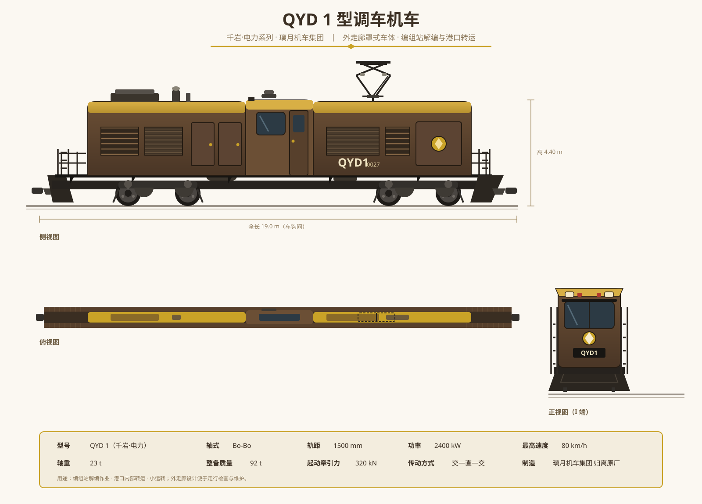
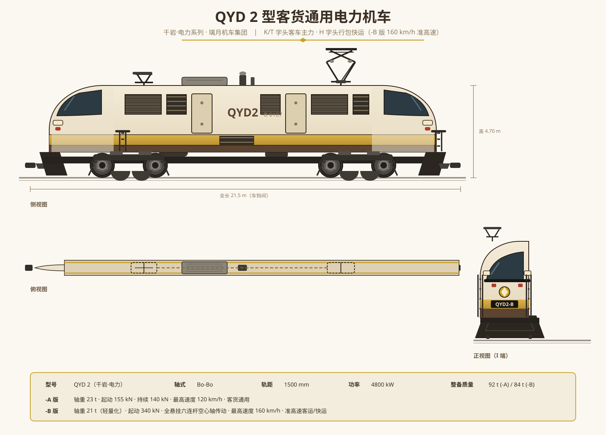
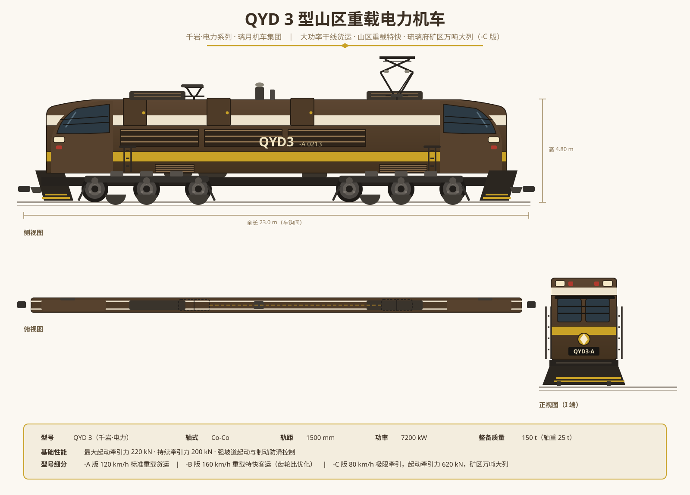
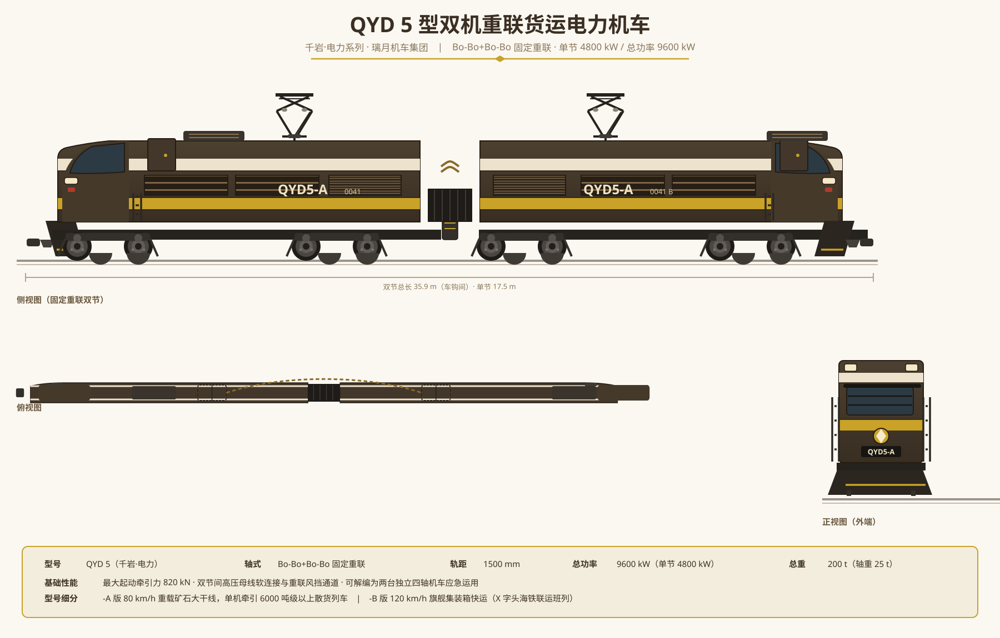
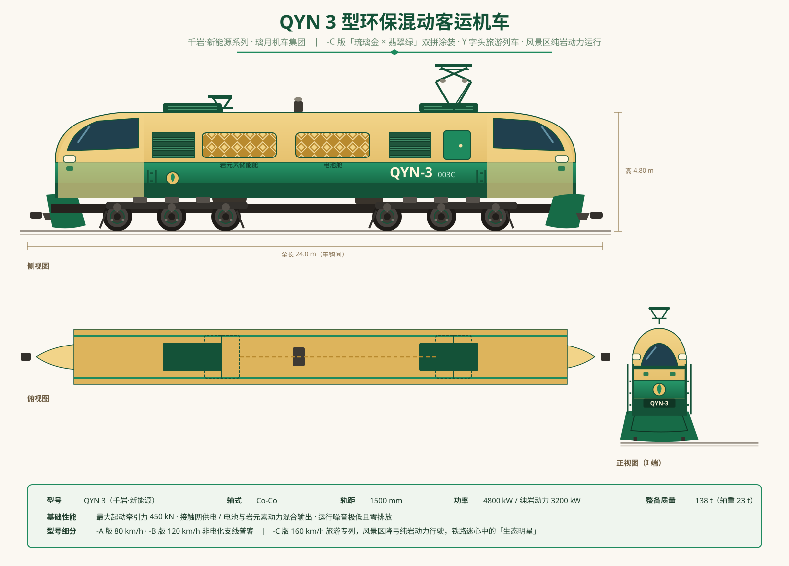
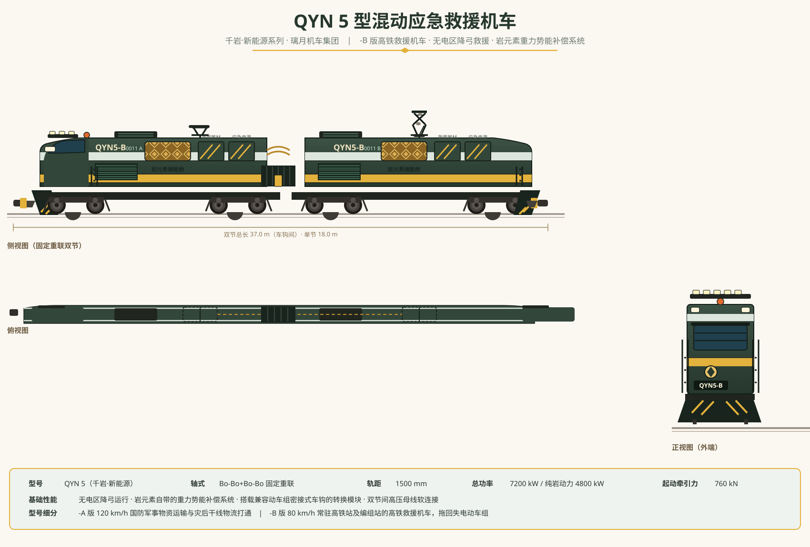
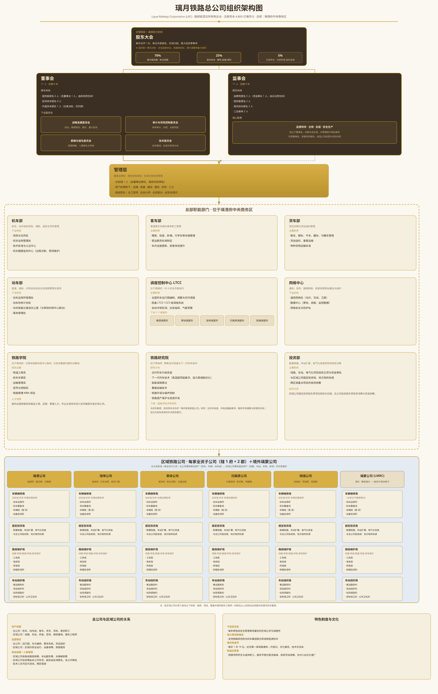

## 简介

璃月共和国有 7200 万人口、面积为 64 万平方千米，五大城市如下。

- 璃港府：首都、经济中心、最大港口城市、位于南部、约 1050 万人口、约 3750 平方千米；
- 珑埠府：经济副中心、次大港口城市、位于北部、约 930 万人口、约 3333 平方千米；
- 翠玦府：高新科技中心、科研创新中心、位于中部、约 700 万人口、约 1250 平方千米；
- 归离原府：工业中心、制造中心、位于东部、约 1160 万人口、约 4167 平方千米；
- 琉璃府：资源中心、初加工中心、低端工业承接区、西南战略支点、位于西部、约 360 万人口、约 3333 平方千米。详见《[关于琉璃设府的决定](./关于琉璃设府的决定.md)》。

此外该国还有十个与府平级的郡，下辖若干个与府辖区平级的县和市。受发达铁路的竞争，国内航空生存艰难，中长途旅行基本被铁路垄断。翠玦府到璃港府、珑埠府、归离原府的距离约为 500 km；璃港府到归离原府、归离原府到珑埠府的距离约为 700 km；璃港府到琉璃府、琉璃府到珑埠府的距离约为 1000 km。

## 五府主要火车站

### 璃港府

- 璃港北站：高铁兼市郊综合枢纽站，10 台 20 线；
- 璃港东站：高速场 4 台 8 线、普速场 4 台 10 线；
- 璃港西站：纯普速站，4 台 8 线。

### 珑埠府

- 珑埠南站：纯高铁站，9 台 18 线；
- 珑埠东站：高速场 3 台 6 线、普速场 3 台 8 线；
- 珑埠西站：纯普速站，3 台 6 线。

### 翠玦府

- 翠玦西站：纯高铁站，8 台 18 线；
- 翠玦站：纯普速站，4 台 10 线；
- 翠玦东站：高速场 4 台 10 线、普速场 4 台 10 线。

### 归离原府

- 归离原西站：纯高铁站，10 台 20 线；
- 归离原站：纯普速站，4 台 10 线；
- 归离原南站：高速场 3 台 6 线、普速场 4 台 9 线。

### 琉璃府

- 琉璃站：纯普速站，2 台 5 线；
- 琉璃东站：纯普速站，3 台 8 线。

## 重要铁路一览

- 高速铁路（240 km/h 双线电气化铁路，预留 320 km/h 提速条件）：璃港府 - 翠玦府 - 珑埠府、翠玦府 - 归离原府；
- 高速铁路（240 km/h 双线电气化铁路）：璃港府 - 归离原府 - 珑埠府（归离原府 - 珑埠府段已开通运营，璃港府 - 归离原府段受困难地质影响，仍在开山架桥土建中）；
- 快速铁路（160 km/h 双线电气化铁路）：璃港府 - 翠玦府 - 珑埠府、璃港府 - 归离原府 - 珑埠府、琉璃府 - 翠玦府 - 归离原府；
- 快速铁路（160 km/h 双线电气化铁路）：归离原府 - 国境，即西南跨境通道的璃月段，出境接[蒙德](../蒙德/蒙德铁路概况.md)西南跨境线（该线现为[蒙德](../蒙德/蒙德综述.md)主干线之一）；
- 普快铁路（120 km/h 双线电气化铁路）：璃港府 - 琉璃府 - 珑埠府；
- 普快铁路（120 km/h 双线电气化铁路，重载化改造）：琉璃府 - 归离原府（不途经翠玦府，截弯取直，空载 120 km/h、满载 80 km/h，一列最大运力 8000 吨、预留 12000 吨条件，以工业原料运输为主；返程利用空余运力回运陶瓷、纺织品等制成品至归离原站分拨）。

璃港府 - 翠玦府 - 珑埠府、翠玦府 - 归离原府两条高速铁路在建设时已预留 320 km/h 的线路条件与信号升级空间，但受制于昂贵的[枫丹](../枫丹/枫丹综述.md)产移动闭塞系统、大幅提升的耗电量、国产化率的下降以及客流尚未触顶等因素，提速规划仍将长期调研，短期内无启动实施计划。璃港府 - 归离原府 - 珑埠府高速铁路则因沿线地质环境复杂、桥隧比高，加之先前建成运营的高速铁路客流增长低于预期，提速规划长期搁置，故未预留 320 km/h 提速条件。

高铁线路的建设并非仅以旅客时间节省为唯一回报来源。240 km/h 高速铁路网的核心经济逻辑在于**释放既有快速铁路 (160 km/h) 的货运能力**——将长途客运从既有线剥离转移至高铁后，既有线得以增开重载货运班列，服务于层岩巨渊—归离原工业区—璃月港的矿产与工业品运输走廊。同时，[五府](./璃月行政区划.md)之间的商务人员当日往返成为可能，加速了金融、科技和人才要素在府际间的流动。因此，即便高铁与快速铁路的速度差尚不足以构成绝对竞争优势，其综合经济效益已超越了单纯的客运时间维度。

普快铁路与快速铁路以工业运输为主、兼顾人员流动，运力紧张时可砍掉部分客运以保证货运需求；高速铁路以人员流动为主、兼顾高时效物运输，运力紧张时可砍掉部分货运以保证客运时效。

有条件的城际铁路、市域铁路已与快速铁路分离，但本文不做详细描述，因其产权归属于地方铁路或地方政府。此类列车由当地调度所全权操作，调度控制中心 (LTCC) 对所内列车仅名义上统一调度，跨所城际列车除外。市域铁路的府属规划、产权与票价细节见《[璃月城市轨道交通概况](./璃月城市轨道交通概况.md)》。

## 国产列车

### 通用技术基准

- **轨距**：1500 mm（标准轨）。
- **供电制式**：单相交流 25 kV、50 Hz（接触网受流），部分混合动力车型支持内燃或岩元素储能供电。
- **信号系统**：全路段普及 LTCS（璃月列车控制系统，Liyue Train Control System）。普速铁路采用 LTCS-2 级固定闭塞，高铁及市郊线路采用基于无线通信的 LTCS-3 级半移动闭塞，智能型与下一代列车另装备 LTCS-4 级移动闭塞并支持 ATO 自动驾驶。各型列车同时装备 LRK 系列运行监控装置（璃月运行监控装置，Liyue Running Kit），在 LTCS 之外独立提供超速防护后备。
- **研发制造方**：璃月机车集团公司（主厂区位于归离原府，测试中心和研究所位于翠玦府）。璃月国内在用的 LR 系列动车组由该公司独家研制与制造，全系统无第二家整车制造厂商。

### 国产化率

国产化率按**全系统采购金额**计，即线路土建、供电信号与车辆装备的综合比例。其中线路土建（桥梁、隧道、供电设施）是璃月基建与冶金的最强项，国产化率超过 95%，差距主要体现在车辆与信号装备上。

- **160 km/h 及以下（普速铁路与客车）**：约 90%。该速度等级技术完全成熟，QYD/QYN 系列机车、客车车厢、LR 160 F/J 动车组及 LTCS-2 固定闭塞信号均为国产，成熟机械制造体系使国产全生命周期成本占优，市场自发选择国产替代；剩余进口集中在[稻妻](../稻妻/稻妻综述.md)半导体（控制电子）与[枫丹](../枫丹/枫丹综述.md)精密仪器（计量仪表）等小件。
- **200 km/h（准高速城际，LR 200 系列）**：约 80%。LR 200 已是成熟量产平台，但车载计算机、功率半导体等电子部件仍依赖进口；与[蒙德](../蒙德/蒙德综述.md)合作运用的 LR 200 J 动力集中式平台因引入新部件，初期国产化率略低（约 75%）。
- **240 km/h（高速动车组，LR 240 系列）**：约 70%。LR 240 已量产多版本，覆盖长编、高寒、智能、城际、卧铺、货运、可变轨距与出口等衍生型，车体、转向架、牵引电机等主体为国产，但高端功率半导体、精密仪器与部分高速关键部件仍依赖进口——[枫丹](../枫丹/枫丹综述.md)的高速铁路牵引系统（SiC 变流器）出口正是[枫丹](../枫丹/枫丹综述.md)对璃月贸易的核心支撑。
- **320 km/h（LR 320 系列，定型储备）**：约 50%。LR 320 已完成定型与样车验证，具备量产条件，但因提速规划搁置而未批量投产，供应链尚未经历批量培育；平台采用的[枫丹](../枫丹/枫丹综述.md) SiC VVVF 变流器、[枫丹](../枫丹/枫丹综述.md)移动闭塞系统、永磁同步电机磁材，以及璃月产能不足的轻量化复合材料均依赖进口。国产化率的下降也正是 320 km/h 提速规划长期搁置的经济原因之一。

### 动车组

**LR 240 系列（高速动车组）**：长途跨司干线客运，[璃月铁路](./璃月铁路概况.md)系统的门面，主要用于大站快车或隔站停车次。全系由璃月机车集团公司独家研制，8 节标准编组为 4 M 4 T，长编型为 16 节 8 M 8 T，另有高寒、智能、城际、检测、卧铺、货运、可变轨距、出口等衍生型，以及 LR 240 J 动力集中型。标准版定员 650 人，设商务座、一等座与二等座；-Z 智能型加装智能调光舷窗、车载 Wi-Fi 与主动降噪设备，餐车设有茶水吧台。

**主要参数总表**

| 型号 | 编组 | 全长/m | 宽度/mm | 高度/mm | 设计速度 | 运营速度 | 实验速度 | 列控系统 | 总功率/kW | 启动加速度/km·h⁻¹·s⁻¹ | 数量/列 |
| :--- | :--- | :--- | :--- | :--- | :--- | :--- | :--- | :--- | :--- | :--- | :--- |
| **LR 240** | 4 M 4 T | 209.06 | 3360 | 4050 | 250 km/h | 240 km/h | 275 km/h | LTCS-2(200 km/h)H/C 型＋LRK-2 | 6600 | 1.76 | 1000 |
| **LR 240-A** | 8 M 8 T | 414.26 | 3360 | 4050 | 250 km/h | 240 km/h | 275 km/h | LTCS-2(200 km/h)H/C 型＋LRK-2 | 13200 | 1.76 | 600 |
| **LR 240-G** | 4 M 4 T | 209.06 | 3360 | 4180 | 275 km/h | 240 km/h | 300 km/h | LTCS-2(200 km/h)H/C 型＋LRK-2 | 7400 | 1.68 | 310 |
| **LR 240-AG** | 8 M 8 T | 414.26 | 3360 | 4180 | 275 km/h | 240 km/h | 300 km/h | LTCS-2(200 km/h)H/C 型＋LRK-2 | 14800 | 1.68 | 175 |
| **LR 240-Z** | 4 M 4 T | 211.31 | 3360 | 4050 | 275 km/h | 240 km/h | 300 km/h | LTCS-3(400 km/h)T 型＋ATO | 6600 | 1.86 | 430 |
| **LR 240-AZ** | 8 M 8 T | 414.26 | 3360 | 4050 | 275 km/h | 240 km/h | 300 km/h | LTCS-3(400 km/h)T 型＋ATO | 13200 | 1.86 | 270 |
| **LR 240-S** | 4 M 4 T | 201.40 | 3300 | 3860 | 250 km/h | 240 km/h | 275 km/h | LTCS-2(200 km/h)C 型＋LRK-2 | 6200 | 2.18 | 680 |
| **LR 240-AS** | 8 M 8 T | 401.40 | 3300 | 3860 | 250 km/h | 240 km/h | 275 km/h | LTCS-2(200 km/h)C 型＋LRK-2 | 12400 | 2.18 | 350 |
| **LR 240-J** | 4 M 4 T | 211.31 | 3360 | 4050 | 300 km/h | 240 km/h | 320 km/h | LTCS-4 ATO＋LRK-15 | 8200 | 1.60 | 10 |
| **LR 240-AJ** | 8 M 8 T | 414.15 | 3360 | 4050 | 300 km/h | 240 km/h | 320 km/h | LTCS-3(300 km/h)T 型＋LRK-2 | 16000 | 1.60 | 2 |
| **LR 240-E** | 8 M 8 T | 414.26 | 3360 | 4050 | 250 km/h | 240 km/h | 275 km/h | LTCS-2(200 km/h)H/C 型＋LRK-2 | 13200 | 1.76 | 110 |
| **LR 240-F** | 4 M 4 T | 209.06 | 3360 | 4015 | 250 km/h | 240 km/h | 275 km/h | LTCS-2(200 km/h)T 型＋LRK-15 | 7400 | 1.40 | 75 |
| **LR 240-FA** | 8 M 8 T | 414.26 | 3360 | 4015 | 250 km/h | 240 km/h | 275 km/h | LTCS-2(200 km/h)T 型＋LRK-15 | 14800 | 1.40 | 55 |
| **LR 240-V** | 4 M 4 T | 212.00 | 3360 | 4050 | 250 km/h | 240 km/h | 275 km/h | LTCS-4 ATO | 6600 | 1.76 | 10 |
| **LR 240-X** | 4 M 4 T | 209.06 | 3360 | 4050 | 250 km/h | 240 km/h | 275 km/h | LTCS-2(200 km/h)H/C 型＋LRK-2 | 6600 | 1.76 | 150 |
| **LR 240-AX** | 8 M 8 T | 414.26 | 3360 | 4050 | 250 km/h | 240 km/h | 275 km/h | LTCS-2(200 km/h)H/C 型＋LRK-2 | 13200 | 1.76 | 95 |
| **LR 240 J** | 1 M 7 T | 208.50 | 3360 | 4436 | 250 km/h | 240 km/h | 275 km/h | LTCS-2(200 km/h)＋LRK-2 | 7200 | 1.26 | 120 |
| **LR 240 J-A** | 2 M 14 T | 459.46 | 3360 | 4436 | 250 km/h | 240 km/h | 275 km/h | LTCS-2(200 km/h)＋LRK-2 | 14400 | 1.26 | 60 |
| **LR 240 J-G** | 1 M 7 T | 208.50 | 3360 | 4436 | 275 km/h | 240 km/h | 300 km/h | LTCS-2(200 km/h)＋LRK-2 | 7600 | 1.20 | 30 |
| **LR 240 J-AG** | 2 M 14 T | 459.46 | 3360 | 4436 | 275 km/h | 240 km/h | 300 km/h | LTCS-2(200 km/h)＋LRK-2 | 15200 | 1.20 | 15 |
| **LR 240 J-E** | 2 M 14 T | 459.46 | 3360 | 4436 | 250 km/h | 240 km/h | 275 km/h | LTCS-2(200 km/h)＋LRK-2 | 14400 | 1.26 | 25 |
| **合计** | — | — | — | — | — | — | — | — | — | — | **4572** |

**基础平台扩展参数**

| 项目 | LR 240 标准 8 节 | LR 240-A 标准 16 节 | LR 240 J 标准 8 节 | LR 240 J-A 标准 16 节 |
| :--- | :--- | :--- | :--- | :--- |
| 编组 | 4 M 4 T | 8 M 8 T | 1 M 7 T | 2 M 14 T |
| 全长/m | 209.06 | 414.26 | 208.50 | 459.46 |
| 车体宽度/mm | 3360 | 3360 | 3360 | 3360 |
| 车体高度/mm | 4050 | 4050 | 4436 | 4436 |
| 轨距/mm | 1500 | 1500 | 1500 | 1500 |
| 供电制式 | AC 25 kV 50 Hz | AC 25 kV 50 Hz | AC 25 kV 50 Hz | AC 25 kV 50 Hz |
| 牵引电机 | 三相异步 412.5 kW×16 | 三相异步 412.5 kW×32 | 永磁同步 7200 kW 总成 | 永磁同步 14400 kW 总成 |
| 牵引变流器 | IGBT 水冷 | IGBT 水冷 | SiC 水冷 | SiC 水冷 |
| 制动方式 | 再生＋电阻＋空气 | 再生＋电阻＋空气 | 再生＋电阻＋空气 | 再生＋电阻＋空气 |
| 常用制动减速度 | ≥0.80 m/s² | ≥0.80 m/s² | ≥0.75 m/s² | ≥0.75 m/s² |
| 紧急制动减速度 | ≥1.20 m/s² | ≥1.20 m/s² | ≥1.10 m/s² | ≥1.10 m/s² |
| 240 km/h 紧急制动距离 | ≤1800 m | ≤1800 m | ≤2000 m | ≤2000 m |
| 轴重 | ≤17 t | ≤17 t | ≤18 t | ≤18 t |
| 轮径/mm | 860/790 | 860/790 | 915/840 | 915/840 |
| 定员/人 | 650 | 1300 | 720 | 1440 |
| 车门/对 | 12 | 24 | 8 | 16 |
| 空调 | 变频热泵 | 变频热泵 | 变频热泵 | 变频热泵 |
| 车内噪声 | ≤62 dB | ≤62 dB | ≤64 dB | ≤64 dB |
| 司机室噪声 | ≤68 dB | ≤68 dB | ≤70 dB | ≤70 dB |
| 能耗 | ≤18.5 kWh/km | ≤35 kWh/km | ≤20 kWh/km | ≤38 kWh/km |
| 运用温度 | -25～+45 ℃ | -25～+45 ℃ | -25～+45 ℃ | -25～+45 ℃ |
| 高寒型运用温度 | -40～+40 ℃ | -40～+40 ℃ | -40～+40 ℃ | -40～+40 ℃ |
| 最大坡度 | 30‰ | 30‰ | 30‰ | 30‰ |
| 最小曲线半径 | 150 m 单车 / 180 m 连挂 | 150 m 单车 / 180 m 连挂 | 180 m 单车 / 220 m 连挂 | 180 m 单车 / 220 m 连挂 |
| 设计寿命 | 30 年 | 30 年 | 30 年 | 30 年 |

**8 节标准编组示例：LR 240**

| 车号 | 型式 | 定员 | 主要设备 |
| :--- | :--- | :--- | :--- |
| 1 | T | 65 | 司机室、前部逃生、受电弓、空调控制 |
| 2 | M | 90 | 牵引变流器、牵引电机、辅助变流器 |
| 3 | M | 90 | 牵引变流器、牵引电机、制动控制 |
| 4 | T | 80 | 主变压器、辅助电源、卫生间 |
| 5 | M | 80 | 牵引变流器、牵引电机、空气压缩机 |
| 6 | M | 90 | 牵引变流器、牵引电机、辅助变流器 |
| 7 | T | 90 | 辅助电源、充电机、卫生间 |
| 8 | T | 65 | 司机室、前部逃生、受电弓、空调控制 |
| **合计** | **4 M 4 T** | **650** | — |

**16 节标准编组示例：LR 240-A**

| 单元 | 车号 | 编组 | 定员 | 说明 |
| :--- | :--- | :--- | :--- | :--- |
| 第一单元 | 1～8 | 4 M 4 T | 650 | 与 LR 240 相同 |
| 第二单元 | 9～16 | 4 M 4 T | 650 | 与 LR 240 相同 |
| **合计** | **1～16** | **8 M 8 T** | **1300** | 双单元重联，贯通控制 |

**衍生型定员与载重**

| 型号 | 编组 | 定员/人 | 载重/t | 备注 |
| :--- | :--- | :--- | :--- | :--- |
| LR 240-S 城际 8 节 | 4 M 4 T | 1200 | — | 大开门、快起快停，启动加速度 2.18 km·h⁻¹·s⁻¹ |
| LR 240-AS 城际 16 节 | 8 M 8 T | 2400 | — | 双单元城际编组 |
| LR 240-E 卧铺 16 节 | 8 M 8 T | 880 | — | 夜间卧铺、软卧与动卧混合 |
| LR 240-J 检测 8 节 | 4 M 4 T | 240 | — | 综合检测，弓网、轨道与信号检测 |
| LR 240-F 货运 8 节 | 4 M 4 T | 2 | 120 | 货运动车组，最高 240 km/h |
| LR 240-FA 货运 16 节 | 8 M 8 T | 4 | 240 | 长编货运，双单元 |
| LR 240 J 动力集中 8 节 | 1 M 7 T | 720 | — | 动力车加拖车，适用普速与快速线 |
| LR 240 J-A 动力集中 16 节 | 2 M 14 T | 1440 | — | 双动力车推挽 |
| LR 240 J-E 卧铺 16 节 | 2 M 14 T | 960 | — | 动力集中卧铺型 |

**列控与信号配置**

| 列控代码 | 适用车型 | 主要能力 |
| :--- | :--- | :--- |
| LTCS-2(200 km/h)H/C 型＋LRK-2 | LR 240 标准型、长编、高寒型、卧铺型、出口型 | 200 km/h 级高铁与城际，兼容 LRK-2 监控装置 |
| LTCS-2(200 km/h)C 型＋LRK-2 | LR 240-S/AS 城际型 | 城际铁路、公交化运行 |
| LTCS-2(200 km/h)T 型＋LRK-15 | LR 240-F/FA 货运型 | 货运动车组列控 |
| LTCS-3(300 km/h)T 型＋LRK-2 | LR 240-AJ 检测型 | 高速综合检测 |
| LTCS-3(400 km/h)T 型＋ATO | LR 240-Z/AZ 智能型 | 更高等级列控，ATO 站台精准停车 |
| LTCS-4 ATO＋LRK-15 | LR 240-J 检测型 | 下一代列控，支持更短追踪间隔 |
| LTCS-4 ATO | LR 240-V 可变轨距型 | 下一代列控，支持跨境直通运行 |
| LTCS-2(200 km/h)＋LRK-2 | LR 240 J 系列 | 动力集中型，兼容普速线路 |

**数量汇总**

| 类别 | 列数 |
| :--- | :--- |
| 标准与长编 | 1600 |
| 城际型 | 1030 |
| 高寒型 | 485 |
| 智能型 | 700 |
| 出口型 | 245 |
| 检测型 | 12 |
| 卧铺型 | 110 |
| 货运型 | 130 |
| 可变轨距 | 10 |
| 动力集中型 | 250 |
| **总计** | **4572** |

**LR 320 系列（高速动车组，定型储备）**：提速至 320 km/h 后的高速动车组平台。平台已完成定型与样车试制验证，具备量产条件；由于 320 km/h 提速规划长期搁置，实际交付以技术储备与在手订单小批量为主，尚未形成大规模配属。牵引系统采用[枫丹](../枫丹/枫丹综述.md)进口的 SiC（碳化硅）VVVF 变流器配合永磁同步牵引电机，8 节标准编组为 4 M 4 T，长编型为 16 节 8 M 8 T，另有高寒、智能、城际、检测、卧铺、货运、可变轨距、出口等衍生型与 LR 320 J 动力集中型。下表数量除已交付的试验与储备车外，均为规划配属与在手订单口径。

**主要参数总表**

| 型号 | 编组 | 全长/m | 宽度/mm | 高度/mm | 设计速度 | 运营速度 | 实验速度 | 列控系统 | 总功率/kW | 启动加速度/km·h⁻¹·s⁻¹ | 数量/列 |
| :--- | :--- | :--- | :--- | :--- | :--- | :--- | :--- | :--- | :--- | :--- | :--- |
| **LR 320** | 4 M 4 T | 208.95 | 3360 | 4050 | 350 km/h | 320 km/h | 385 km/h | LTCS-3(300 km/h)S 型 | 9600 | 1.85 | 620 |
| **LR 320-A** | 8 M 8 T | 414.15 | 3360 | 4050 | 350 km/h | 320 km/h | 385 km/h | LTCS-3(300 km/h)S 型 | 19200 | 1.85 | 380 |
| **LR 320-G** | 4 M 4 T | 208.95 | 3360 | 4180 | 350 km/h | 320 km/h | 385 km/h | LTCS-3(300 km/h)S/T 型 | 10140 | 1.80 | 210 |
| **LR 320-AG** | 8 M 8 T | 414.15 | 3360 | 4180 | 350 km/h | 320 km/h | 385 km/h | LTCS-3(300 km/h)S/T 型 | 20280 | 1.80 | 120 |
| **LR 320-Z** | 4 M 4 T | 209.09 | 3360 | 4050 | 380 km/h | 320 km/h | 400 km/h | LTCS-3(400 km/h)T 型＋ATO | 10140 | 1.90 | 260 |
| **LR 320-AZ** | 8 M 8 T | 414.26 | 3360 | 4050 | 380 km/h | 320 km/h | 400 km/h | LTCS-3(400 km/h)T 型＋ATO | 20280 | 1.90 | 160 |
| **LR 320-S** | 4 M 4 T | 201.40 | 3300 | 3860 | 350 km/h | 320 km/h | 385 km/h | LTCS-3(300 km/h)S/T 型 | 11000 | 2.00 | 400 |
| **LR 320-AS** | 8 M 8 T | 401.40 | 3300 | 3860 | 350 km/h | 320 km/h | 385 km/h | LTCS-3(300 km/h)S/T 型 | 22000 | 2.00 | 220 |
| **LR 320-J** | 4 M 4 T | 208.95 | 3360 | 4050 | 400 km/h | 320 km/h | 435 km/h | LTCS-3(400 km/h)T 型＋LRK-2 | 12000 | 1.90 | 8 |
| **LR 320-AJ** | 8 M 8 T | 414.15 | 3360 | 4050 | 400 km/h | 320 km/h | 435 km/h | LTCS-3(400 km/h)T 型＋LRK-2 | 24000 | 1.90 | 3 |
| **LR 320-E** | 8 M 8 T | 414.15 | 3360 | 4050 | 350 km/h | 320 km/h | 385 km/h | LTCS-3(300 km/h)S/T 型 | 19200 | 1.85 | 80 |
| **LR 320-F** | 4 M 4 T | 208.95 | 3360 | 4050 | 350 km/h | 320 km/h | 385 km/h | LTCS-3(300 km/h)T 型＋LRK-15 | 9600 | 1.45 | 50 |
| **LR 320-FA** | 8 M 8 T | 414.15 | 3360 | 4050 | 350 km/h | 320 km/h | 385 km/h | LTCS-3(300 km/h)T 型＋LRK-15 | 19200 | 1.45 | 30 |
| **LR 320-V** | 4 M 4 T | 212.00 | 3360 | 4050 | 400 km/h | 320 km/h | 420 km/h | LTCS-4 ATO | 11000 | 1.85 | 8 |
| **LR 320-X** | 4 M 4 T | 208.95 | 3360 | 4050 | 350 km/h | 320 km/h | 385 km/h | LTCS-3(300 km/h)S 型 | 9600 | 1.85 | 100 |
| **LR 320-AX** | 8 M 8 T | 414.15 | 3360 | 4050 | 350 km/h | 320 km/h | 385 km/h | LTCS-3(300 km/h)S 型 | 19200 | 1.85 | 60 |
| **LR 320 J** | 1 M 7 T | 208.50 | 3360 | 4436 | 350 km/h | 320 km/h | 385 km/h | LTCS-2(200 km/h)＋LRK-2 | 9600 | 1.30 | 150 |
| **LR 320 J-A** | 2 M 14 T | 459.46 | 3360 | 4436 | 350 km/h | 320 km/h | 385 km/h | LTCS-2(200 km/h)＋LRK-2 | 19200 | 1.30 | 80 |
| **LR 320 J-G** | 1 M 7 T | 208.50 | 3360 | 4436 | 350 km/h | 320 km/h | 385 km/h | LTCS-2(200 km/h)＋LRK-2 | 10140 | 1.25 | 40 |
| **LR 320 J-AG** | 2 M 14 T | 459.46 | 3360 | 4436 | 350 km/h | 320 km/h | 385 km/h | LTCS-2(200 km/h)＋LRK-2 | 20280 | 1.25 | 20 |
| **LR 320 J-E** | 2 M 14 T | 459.46 | 3360 | 4436 | 350 km/h | 320 km/h | 385 km/h | LTCS-2(200 km/h)＋LRK-2 | 19200 | 1.30 | 30 |
| **LR 320 J-Z** | 1 M 7 T | 208.50 | 3360 | 4436 | 380 km/h | 320 km/h | 400 km/h | LTCS-3(400 km/h)T 型＋ATO | 10140 | 1.35 | 50 |
| **LR 320 J-AZ** | 2 M 14 T | 459.46 | 3360 | 4436 | 380 km/h | 320 km/h | 400 km/h | LTCS-3(400 km/h)T 型＋ATO | 20280 | 1.35 | 30 |
| **合计** | — | — | — | — | — | — | — | — | — | — | **3109** |

**基础平台扩展参数**

| 项目 | LR 320 标准 8 节 | LR 320-A 标准 16 节 | LR 320 J 标准 8 节 | LR 320 J-A 标准 16 节 |
| :--- | :--- | :--- | :--- | :--- |
| 编组 | 4 M 4 T | 8 M 8 T | 1 M 7 T | 2 M 14 T |
| 全长/m | 208.95 | 414.15 | 208.50 | 459.46 |
| 车体宽度/mm | 3360 | 3360 | 3360 | 3360 |
| 车体高度/mm | 4050 | 4050 | 4436 | 4436 |
| 轨距/mm | 1500 | 1500 | 1500 | 1500 |
| 供电制式 | AC 25 kV 50 Hz | AC 25 kV 50 Hz | AC 25 kV 50 Hz | AC 25 kV 50 Hz |
| 牵引电机 | 永磁同步 600 kW×16 | 永磁同步 600 kW×32 | 永磁同步总成 9600 kW | 永磁同步总成 19200 kW |
| 牵引变流器 | SiC 水冷 | SiC 水冷 | SiC 水冷 | SiC 水冷 |
| 制动方式 | 再生＋电阻＋空气 | 再生＋电阻＋空气 | 再生＋电阻＋空气 | 再生＋电阻＋空气 |
| 常用制动减速度 | ≥0.85 m/s² | ≥0.85 m/s² | ≥0.80 m/s² | ≥0.80 m/s² |
| 紧急制动减速度 | ≥1.25 m/s² | ≥1.25 m/s² | ≥1.15 m/s² | ≥1.15 m/s² |
| 320 km/h 紧急制动距离 | ≤3200 m | ≤3200 m | ≤3500 m | ≤3500 m |
| 轴重 | ≤17 t | ≤17 t | ≤18 t | ≤18 t |
| 轮径/mm | 860/790 | 860/790 | 915/840 | 915/840 |
| 定员/人 | 620 | 1240 | 700 | 1400 |
| 车门/对 | 12 | 24 | 8 | 16 |
| 空调 | 变频热泵 | 变频热泵 | 变频热泵 | 变频热泵 |
| 车内噪声 | ≤64 dB | ≤64 dB | ≤66 dB | ≤66 dB |
| 司机室噪声 | ≤70 dB | ≤70 dB | ≤72 dB | ≤72 dB |
| 能耗 | ≤22 kWh/km | ≤42 kWh/km | ≤24 kWh/km | ≤46 kWh/km |
| 运用温度 | -25～+45 ℃ | -25～+45 ℃ | -25～+45 ℃ | -25～+45 ℃ |
| 高寒型运用温度 | -40～+40 ℃ | -40～+40 ℃ | -40～+40 ℃ | -40～+40 ℃ |
| 最大坡度 | 30‰ | 30‰ | 30‰ | 30‰ |
| 最小曲线半径 | 150 m 单车 / 180 m 连挂 | 150 m 单车 / 180 m 连挂 | 180 m 单车 / 220 m 连挂 | 180 m 单车 / 220 m 连挂 |
| 设计寿命 | 30 年 | 30 年 | 30 年 | 30 年 |

**8 节标准编组示例：LR 320**

| 车号 | 型式 | 定员 | 主要设备 |
| :--- | :--- | :--- | :--- |
| 1 | T | 60 | 司机室、前部逃生、受电弓、空调控制 |
| 2 | M | 85 | 牵引变流器、牵引电机、辅助变流器 |
| 3 | M | 85 | 牵引变流器、牵引电机、制动控制 |
| 4 | T | 75 | 主变压器、辅助电源、卫生间 |
| 5 | M | 80 | 牵引变流器、牵引电机、空气压缩机 |
| 6 | M | 85 | 牵引变流器、牵引电机、辅助变流器 |
| 7 | T | 80 | 辅助电源、充电机、卫生间 |
| 8 | T | 70 | 司机室、前部逃生、受电弓、空调控制 |
| **合计** | **4 M 4 T** | **620** | — |

**16 节标准编组示例：LR 320-A**

| 单元 | 车号 | 编组 | 定员 | 说明 |
| :--- | :--- | :--- | :--- | :--- |
| 第一单元 | 1～8 | 4 M 4 T | 620 | 与 LR 320 相同 |
| 第二单元 | 9～16 | 4 M 4 T | 620 | 与 LR 320 相同 |
| **合计** | **1～16** | **8 M 8 T** | **1240** | 双单元重联，贯通控制 |

**衍生型定员与用途**

| 型号 | 编组 | 定员/人 | 载重/t | 用途 | 备注 |
| :--- | :--- | :--- | :--- | :--- | :--- |
| LR 320-S 城际 8 节 | 4 M 4 T | 1200 | — | 城际高速 | 大开门、快起快停 |
| LR 320-AS 城际 16 节 | 8 M 8 T | 2400 | — | 城际高速长编 | 双单元公交化 |
| LR 320-E 卧铺 16 节 | 8 M 8 T | 800 | — | 夜间卧铺 | 软卧与动卧混合 |
| LR 320-J 检测 8 节 | 4 M 4 T | 200 | — | 综合检测 | 弓网、轨道与信号检测 |
| LR 320-AJ 检测 16 节 | 8 M 8 T | 400 | — | 综合检测长编 | 双单元检测 |
| LR 320-F 货运 8 节 | 4 M 4 T | 2 | 120 | 高速货运 | 电商与快递 |
| LR 320-FA 货运 16 节 | 8 M 8 T | 4 | 240 | 高速货运长编 | 双单元货运 |
| LR 320 J 动力集中 8 节 | 1 M 7 T | 700 | — | 动力集中 | 兼容普速与快速线 |
| LR 320 J-A 动力集中 16 节 | 2 M 14 T | 1400 | — | 动力集中长编 | 双动力车推挽 |
| LR 320 J-E 卧铺 16 节 | 2 M 14 T | 900 | — | 动力集中卧铺 | 夜间长交路 |
| LR 320 J-Z 智能动力集中 8 节 | 1 M 7 T | 700 | — | 智能动力集中 | ATO 精准停车 |
| LR 320 J-AZ 智能动力集中 16 节 | 2 M 14 T | 1400 | — | 智能动力集中长编 | 双单元智能控制 |

**列控与信号配置**

| 列控代码 | 适用车型 | 主要能力 |
| :--- | :--- | :--- |
| LTCS-3(300 km/h)S 型 | LR 320、LR 320-A、LR 320-X/AX 出口型 | 300 km/h 级列控，支持 320 km/h 运营 |
| LTCS-3(300 km/h)S/T 型 | LR 320-G/AG 高寒型、LR 320-S/AS 城际型、LR 320-E 卧铺型 | 兼容 S/T 模式，支持 320 km/h |
| LTCS-3(300 km/h)T 型＋LRK-15 | LR 320-F/FA 货运型 | 货运列控 |
| LTCS-3(400 km/h)T 型＋ATO | LR 320-Z/AZ 智能型、LR 320 J-Z/AZ 智能动力集中型 | 400 km/h 级列控，ATO 精准停车 |
| LTCS-3(400 km/h)T 型＋LRK-2 | LR 320-J/AJ 检测型 | 高速综合检测 |
| LTCS-4 ATO | LR 320-V 可变轨距型 | 下一代列控，支持移动闭塞 |
| LTCS-2(200 km/h)＋LRK-2 | LR 320 J 系列 | 动力集中型，兼容普速线路 |
| LRK-2000 | 兼容备份 | 普速线路后备 |

**数量汇总**

| 类别 | 列数 |
| :--- | :--- |
| 标准与长编 | 1000 |
| 城际型 | 620 |
| 高寒型 | 330 |
| 智能型 | 420 |
| 出口型 | 160 |
| 检测型 | 11 |
| 卧铺型 | 80 |
| 货运型 | 80 |
| 可变轨距 | 8 |
| 动力集中型 | 400 |
| **总计** | **3109** |

**补充技术数据与试验节点**

| 项目 | 数据 |
| :--- | :--- |
| 试验速度节点 | LR 320：385 km/h；LR 320-Z：400 km/h；LR 320-J：435 km/h；LR 320-V：420 km/h；LR 320 J：385 km/h |
| 320 km/h 紧急制动距离 | ≤3200 m（标准型）；≤3500 m（LR 320 J 系列） |
| 320 km/h 常用制动距离 | ≤5000 m |
| 8 节能耗 | ≤22 kWh/km（标准型）；≤24 kWh/km（J 系列） |
| 16 节能耗 | ≤42 kWh/km（标准型）；≤46 kWh/km（J 系列） |
| 受电弓 | 8 节 2 弓；16 节 4 弓 |
| 车门 | 8 节 12 对；16 节 24 对 |
| 空调 | 变频热泵，新风量 ≥15 m³/h·人 |
| 车体材质 | 铝合金大型中空型材 |
| 走行部 | 无摇枕空气弹簧转向架 |
| 牵引电机 | 永磁同步 600 kW×16/32 |
| 牵引变流器 | SiC 水冷 |
| 辅助供电 | AC 380 V / DC 110 V，双路冗余 |
| 轴重 | ≤17 t（标准型）；≤18 t（J 系列） |
| 轮径 | 860/790 mm（标准型）；915/840 mm（J 系列） |
| 设计寿命 | 30 年 |
| 运用温度 | -25～+45 ℃；高寒型 -40～+40 ℃ |
| 最大坡度 | 30‰ |
| 最小曲线半径 | 150 m 单车 / 180 m 连挂；J 系列 180 m 单车 / 220 m 连挂 |

**现状**：LR 240 系列的后续智能化和增购订单仍是投产主流。LR 320 维持定型平台与小批量生产能力，配属节奏取决于 320 km/h 提速规划是否启动。

**LR 200 系列（准高速动车组）**：四大府城市圈（如相邻县市）之间的中短途城际，或长途跨司干线客运的站站停车次。

- **基本编组**：8 辆编组 (4 M 4 T)，总长 201 米；车体最大宽度 3.40 米。
- **动力与性能**：
    - 总功率：5600 kW；
    - 启动加速度：$0.72 \,\mathrm{m}/\mathrm{s}^2$（强调快起快停，适应城际线路密集的停站）；
    - 转向架：采用空气弹簧悬挂，优化 200 km/h 速度下的通过曲线性能。
- **载客量与内饰**：
    - 定员 645 人（全列高密度二等座及少量一等座）。
    - 采用宽幅双开塞拉门，车门宽度增至 1300 mm，极大缩短旅客上下车时间。
    - **-S 版（短编组）**：4 辆编组 (2 M 2 T)，常用于客流较少的卫星城放射线，支持两组重联运行。

**LR 160 F 系列（市郊高密度动车组）**：府内市郊通勤，类似于「大号地铁」，承担潮汐客流。

- **基本编组**：8 辆编组 (4 M 4 T) 或 4 辆编组（-S 版），总长 195 米。
- **动力与性能**：
    - 总功率：5600 kW；
    - 启动加速度：高达 $0.84 \,\mathrm{m}/\mathrm{s}^2$；
    - 具有极强的再生制动能力，适应站间距 3～5 km 的频繁起停工况。
- **载客量与内饰**：
    - 采用纵向靠墙座椅布局（地铁式），标准 8 编组定员 1580 人，超员载客量可达 2100 人。
    - 每节车厢设有 2 至 3 对 1400 mm 宽的双开塞拉门。取消独立洗手间，最大化站立空间。

**LR 200 J 系列（动力集中式准高速动车组）**：快速铁路 200 km/h 提速后的最终客运平台，替代既有提速线上 LR 200 系列的动力分散式动车组，实现普速动车组平台的统一化与标准化。6 节标准编组为 1 M 5 T（1 辆动力车＋4 辆拖车＋1 辆带驾驶室的控制车），长编型为 12 节 2 M 10 T。相较 LR 160 J 的 1 M 7 T 编组更为紧凑，以适应提速段中小编组、高密度开行的需要。平台在 LR 160 J 动力车基础上提升功率并优化悬挂，部件与 LR 160 J 通用。首批车交付璃蒙铁路公司，在[蒙德](../蒙德/蒙德综述.md)主干线 200 km/h 提速段运用，与[蒙德](../蒙德/蒙德综述.md)提速改造同步推进。

**主要参数总表**

| 型号 | 编组 | 全长/m | 宽度/mm | 高度/mm | 设计速度 | 运营速度 | 实验速度 | 列控系统 | 总功率/kW | 启动加速度/km·h⁻¹·s⁻¹ | 数量/列 |
| :--- | :--- | :--- | :--- | :--- | :--- | :--- | :--- | :--- | :--- | :--- | :--- |
| **LR 200 J** | 1 M 5 T | 148.0 | 3360 | 4436 | 220 km/h | 200 km/h | 230 km/h | LTCS-2(200 km/h)＋LRK-2 | 5600 | 1.35 | 600 |
| **LR 200 J-A** | 2 M 10 T | 296.0 | 3360 | 4436 | 220 km/h | 200 km/h | 230 km/h | LTCS-2(200 km/h)＋LRK-2 | 11200 | 1.35 | 350 |
| **LR 200 J-B** | 1 M 5 T | 148.0 | 3360 | 4436 | 250 km/h | 200 km/h | 250 km/h | LTCS-2(200 km/h)＋LRK-2 | 6400 | 1.40 | 300 |
| **LR 200 J-AB** | 2 M 10 T | 296.0 | 3360 | 4436 | 250 km/h | 200 km/h | 250 km/h | LTCS-2(200 km/h)＋LRK-2 | 12800 | 1.40 | 180 |
| **LR 200 J-S** | 1 M 5 T | 148.0 | 3300 | 3860 | 220 km/h | 200 km/h | 230 km/h | LTCS-2(200 km/h)C 型＋LRK-2 | 5600 | 1.50 | 500 |
| **LR 200 J-AS** | 2 M 10 T | 296.0 | 3300 | 3860 | 220 km/h | 200 km/h | 230 km/h | LTCS-2(200 km/h)C 型＋LRK-2 | 11200 | 1.50 | 300 |
| **LR 200 J-S 2** | 1 M 5 T | 148.0 | 3300 | 3860 | 250 km/h | 200 km/h | 250 km/h | LTCS-2(200 km/h)C 型＋LRK-2 | 6400 | 1.55 | 200 |
| **LR 200 J-AS 2** | 2 M 10 T | 296.0 | 3300 | 3860 | 250 km/h | 200 km/h | 250 km/h | LTCS-2(200 km/h)C 型＋LRK-2 | 12800 | 1.55 | 120 |
| **LR 200 J-G** | 1 M 5 T | 148.0 | 3360 | 4436 | 220 km/h | 200 km/h | 230 km/h | LTCS-2(200 km/h)＋LRK-2 | 5600 | 1.30 | 200 |
| **LR 200 J-AG** | 2 M 10 T | 296.0 | 3360 | 4436 | 220 km/h | 200 km/h | 230 km/h | LTCS-2(200 km/h)＋LRK-2 | 11200 | 1.30 | 120 |
| **LR 200 J-G 2** | 1 M 5 T | 148.0 | 3360 | 4436 | 250 km/h | 200 km/h | 250 km/h | LTCS-2(200 km/h)＋LRK-2 | 6400 | 1.35 | 100 |
| **LR 200 J-AG 2** | 2 M 10 T | 296.0 | 3360 | 4436 | 250 km/h | 200 km/h | 250 km/h | LTCS-2(200 km/h)＋LRK-2 | 12800 | 1.35 | 60 |
| **LR 200 J-Z** | 1 M 5 T | 148.0 | 3360 | 4436 | 250 km/h | 200 km/h | 250 km/h | LTCS-2/3(300 km/h)T 型＋ATO | 6400 | 1.45 | 150 |
| **LR 200 J-AZ** | 2 M 10 T | 296.0 | 3360 | 4436 | 250 km/h | 200 km/h | 250 km/h | LTCS-2/3(300 km/h)T 型＋ATO | 12800 | 1.45 | 90 |
| **LR 200 J-Z 2** | 1 M 5 T | 148.0 | 3360 | 4436 | 250 km/h | 200 km/h | 250 km/h | LTCS-3(400 km/h)T 型＋ATO | 7200 | 1.48 | 80 |
| **LR 200 J-AZ 2** | 2 M 10 T | 296.0 | 3360 | 4436 | 250 km/h | 200 km/h | 250 km/h | LTCS-3(400 km/h)T 型＋ATO | 14400 | 1.48 | 50 |
| **LR 200 J-E** | 1 M 5 T | 148.0 | 3360 | 4436 | 220 km/h | 200 km/h | 230 km/h | LRK-2000 | 5600 | 1.35 | 120 |
| **LR 200 J-AE** | 2 M 10 T | 296.0 | 3360 | 4436 | 220 km/h | 200 km/h | 230 km/h | LRK-2000 | 11200 | 1.35 | 80 |
| **LR 200 J-E 2** | 1 M 5 T | 148.0 | 3360 | 4436 | 250 km/h | 200 km/h | 250 km/h | LTCS-2(200 km/h)＋LRK-2 | 6400 | 1.40 | 60 |
| **LR 200 J-AE 2** | 2 M 10 T | 296.0 | 3360 | 4436 | 250 km/h | 200 km/h | 250 km/h | LTCS-2(200 km/h)＋LRK-2 | 12800 | 1.40 | 40 |
| **LR 200 J-H** | 1 M 5 T | 148.0 | 3360 | 4436 | 220 km/h | 200 km/h | 230 km/h | LRK-2000 | 5600 | 1.30 | 80 |
| **LR 200 J-AH** | 2 M 10 T | 296.0 | 3360 | 4436 | 220 km/h | 200 km/h | 230 km/h | LRK-2000 | 11200 | 1.30 | 50 |
| **LR 200 J-X** | 1 M 5 T | 148.0 | 3360 | 4436 | 220 km/h | 200 km/h | 230 km/h | LTCS-2(200 km/h)＋LRK-2 | 5600 | 1.35 | 200 |
| **LR 200 J-AX** | 2 M 10 T | 296.0 | 3360 | 4436 | 220 km/h | 200 km/h | 230 km/h | LTCS-2(200 km/h)＋LRK-2 | 11200 | 1.35 | 120 |
| **LR 200 J-F** | 1 M 5 T | 148.0 | 3360 | 4436 | 220 km/h | 200 km/h | 230 km/h | LTCS-2(200 km/h)T 型＋LRK-15 | 6400 | 1.15 | 60 |
| **LR 200 J-AF** | 2 M 10 T | 296.0 | 3360 | 4436 | 220 km/h | 200 km/h | 230 km/h | LTCS-2(200 km/h)T 型＋LRK-15 | 12800 | 1.15 | 40 |
| **LR 200 J-J** | 1 M 5 T | 148.0 | 3360 | 4436 | 250 km/h | 200 km/h | 250 km/h | LTCS-2(200 km/h)＋LRK-2 | 6400 | 1.40 | 6 |
| **LR 200 J-AJ** | 2 M 10 T | 296.0 | 3360 | 4436 | 250 km/h | 200 km/h | 250 km/h | LTCS-2(200 km/h)＋LRK-2 | 12800 | 1.40 | 3 |
| **LR 200 J-V** | 1 M 5 T | 150.0 | 3360 | 4436 | 250 km/h | 200 km/h | 250 km/h | LTCS-4 ATO | 6400 | 1.40 | 10 |
| **LR 200 J-AV** | 2 M 10 T | 300.0 | 3360 | 4436 | 250 km/h | 200 km/h | 250 km/h | LTCS-4 ATO | 12800 | 1.40 | 6 |
| **LR 200 J-D** | 1 M 5 T | 148.0 | 3360 | 4436 | 220 km/h | 200 km/h | 230 km/h | LRK-2000 | 5600 | 1.35 | 150 |
| **LR 200 J-AD** | 2 M 10 T | 296.0 | 3360 | 4436 | 220 km/h | 200 km/h | 230 km/h | LRK-2000 | 11200 | 1.35 | 90 |
| **LR 200 J-C** | 1 M 5 T | 148.0 | 3360 | 4436 | 220 km/h | 200 km/h | 230 km/h | LRK-2000 | 5600 | 1.35 | 100 |
| **LR 200 J-AC** | 2 M 10 T | 296.0 | 3360 | 4436 | 220 km/h | 200 km/h | 230 km/h | LRK-2000 | 11200 | 1.35 | 60 |
| **LR 200 J-K** | 1 M 5 T | 148.0 | 3360 | 4436 | 220 km/h | 200 km/h | 230 km/h | LTCS-2(200 km/h)T 型＋LRK-15 | 6400 | 1.10 | 30 |
| **LR 200 J-AK** | 2 M 10 T | 296.0 | 3360 | 4436 | 220 km/h | 200 km/h | 230 km/h | LTCS-2(200 km/h)T 型＋LRK-15 | 12800 | 1.10 | 20 |
| **合计** | — | — | — | — | — | — | — | — | — | — | **4725** |

**基础平台扩展参数**

| 项目 | LR 200 J 6 节 | LR 200 J-A 12 节 | LR 200 J-S 城际 6 节 | LR 200 J-AS 城际 12 节 | LR 200 J-G 高寒 6 节 | LR 200 J-E 卧铺 6 节 | LR 200 J-F 货运 6 节 |
| :--- | :--- | :--- | :--- | :--- | :--- | :--- | :--- |
| 编组 | 1 M 5 T | 2 M 10 T | 1 M 5 T | 2 M 10 T | 1 M 5 T | 1 M 5 T | 1 M 5 T |
| 全长/m | 148.0 | 296.0 | 148.0 | 296.0 | 148.0 | 148.0 | 148.0 |
| 车体宽度/mm | 3360 | 3360 | 3300 | 3300 | 3360 | 3360 | 3360 |
| 车体高度/mm | 4436 | 4436 | 3860 | 3860 | 4436 | 4436 | 4436 |
| 轨距/mm | 1500 | 1500 | 1500 | 1500 | 1500 | 1500 | 1500 |
| 供电制式 | AC 25 kV 50 Hz | AC 25 kV 50 Hz | AC 25 kV 50 Hz | AC 25 kV 50 Hz | AC 25 kV 50 Hz | AC 25 kV 50 Hz | AC 25 kV 50 Hz |
| 动力车轴式 | Bo-Bo | Bo-Bo×2 | Bo-Bo | Bo-Bo×2 | Bo-Bo | Bo-Bo | Bo-Bo |
| 牵引电机 | 永磁同步 700 kW×8 | 永磁同步 700 kW×16 | 永磁同步 700 kW×8 | 永磁同步 700 kW×16 | 永磁同步 700 kW×8 | 永磁同步 700 kW×8 | 永磁同步 800 kW×8 |
| 牵引变流器 | SiC 水冷 | SiC 水冷 | SiC 水冷 | SiC 水冷 | SiC 水冷 | SiC 水冷 | SiC 水冷 |
| 制动方式 | 再生＋电阻＋空气 | 再生＋电阻＋空气 | 再生＋电阻＋空气 | 再生＋电阻＋空气 | 再生＋电阻＋空气 | 再生＋电阻＋空气 | 再生＋电阻＋空气 |
| 常用制动减速度 | ≥0.75 m/s² | ≥0.75 m/s² | ≥0.80 m/s² | ≥0.80 m/s² | ≥0.70 m/s² | ≥0.75 m/s² | ≥0.65 m/s² |
| 紧急制动减速度 | ≥1.10 m/s² | ≥1.10 m/s² | ≥1.15 m/s² | ≥1.15 m/s² | ≥1.05 m/s² | ≥1.10 m/s² | ≥1.00 m/s² |
| 200 km/h 紧急制动距离 | ≤2000 m | ≤2000 m | ≤1950 m | ≤1950 m | ≤2050 m | ≤2000 m | ≤2100 m |
| 轴重 | ≤21 t | ≤21 t | ≤20 t | ≤20 t | ≤21 t | ≤21 t | ≤21 t |
| 轮径/mm | 1050/980 | 1050/980 | 1000/930 | 1000/930 | 1050/980 | 1050/980 | 1050/980 |
| 定员/人 | 520 | 1040 | 900 | 1800 | 520 | 300 | 2 |
| 载重/t | — | — | — | — | — | — | 100 |
| 车门/对 | 6 | 12 | 10 | 20 | 6 | 6 | 4 |
| 空调 | 变频热泵 | 变频热泵 | 变频热泵 | 变频热泵 | 变频热泵 | 变频热泵 | 变频热泵 |
| 车内噪声 | ≤64 dB | ≤64 dB | ≤66 dB | ≤66 dB | ≤64 dB | ≤62 dB | ≤66 dB |
| 司机室噪声 | ≤70 dB | ≤70 dB | ≤72 dB | ≤72 dB | ≤70 dB | ≤70 dB | ≤72 dB |
| 能耗 | ≤14 kWh/km | ≤28 kWh/km | ≤15 kWh/km | ≤30 kWh/km | ≤15 kWh/km | ≤14 kWh/km | ≤16 kWh/km |
| 运用温度 | -25～+45 ℃ | -25～+45 ℃ | -25～+45 ℃ | -25～+45 ℃ | -40～+40 ℃ | -25～+45 ℃ | -25～+45 ℃ |
| 最大坡度 | 30‰ | 30‰ | 30‰ | 30‰ | 30‰ | 30‰ | 30‰ |
| 最小曲线半径 | 125 m 单车 / 150 m 连挂 | 125 m 单车 / 150 m 连挂 | 120 m 单车 / 150 m 连挂 | 120 m 单车 / 150 m 连挂 | 125 m 单车 / 150 m 连挂 | 125 m 单车 / 150 m 连挂 | 125 m 单车 / 150 m 连挂 |
| 设计寿命 | 30 年 | 30 年 | 30 年 | 30 年 | 30 年 | 30 年 | 30 年 |

**6 节标准编组示例：LR 200 J**

| 车号 | 型式 | 定员 | 主要设备 |
| :--- | :--- | :--- | :--- |
| 1 | M（动力车） | 0 | 司机室、牵引变流器、牵引电机、受电弓、辅助电源 |
| 2 | T | 110 | 二等座、空调、卫生间 |
| 3 | T | 110 | 二等座、空调、电茶炉 |
| 4 | T | 100 | 二等座、空调、无障碍设施 |
| 5 | T | 100 | 二等座、空调、卫生间 |
| 6 | Tc（控制车） | 100 | 司机室、控制设备、二等座、空调 |
| **合计** | **1 M 5 T** | **520** | — |

**12 节标准编组示例：LR 200 J-A**

| 车号 | 型式 | 定员 | 主要设备 |
| :--- | :--- | :--- | :--- |
| 1 | M（动力车） | 0 | 司机室、牵引变流器、牵引电机、受电弓、辅助电源 |
| 2 | T | 104 | 二等座、空调、卫生间 |
| 3 | T | 104 | 二等座、空调、电茶炉 |
| 4 | T | 104 | 二等座、空调、无障碍设施 |
| 5 | T | 104 | 二等座、空调、卫生间 |
| 6 | T | 104 | 二等座、空调、充电插座 |
| 7 | T | 104 | 二等座、空调、行李架 |
| 8 | T | 104 | 二等座、空调、卫生间 |
| 9 | T | 104 | 二等座、空调、电茶炉 |
| 10 | T | 104 | 二等座、空调、充电插座 |
| 11 | T | 104 | 二等座、空调、行李架 |
| 12 | M（动力车） | 0 | 司机室、牵引变流器、牵引电机、受电弓、辅助电源 |
| **合计** | **2 M 10 T** | **1040** | — |

**衍生型定员与用途**

| 型号 | 编组 | 定员/人 | 载重/t | 用途 | 备注 |
| :--- | :--- | :--- | :--- | :--- | :--- |
| LR 200 J-S | 1 M 5 T | 900 | — | 城际公交化 | 大开门、快起快停 |
| LR 200 J-AS | 2 M 10 T | 1800 | — | 城际长编 | 双动力单元 |
| LR 200 J-E | 1 M 5 T | 300 | — | 夜间卧铺 | 软卧与动卧混合 |
| LR 200 J-AE | 2 M 10 T | 600 | — | 长编卧铺 | 夜间长交路 |
| LR 200 J-G | 1 M 5 T | 520 | — | 高寒 | -40 ℃ 运用 |
| LR 200 J-H | 1 M 5 T | 500 | — | 高原 | 海拔 ≤3500 m |
| LR 200 J-Z | 1 M 5 T | 520 | — | 智能 | ATO 精准停车 |
| LR 200 J-F | 1 M 5 T | 2 | 100 | 高速货运 | 电商与快递 |
| LR 200 J-AF | 2 M 10 T | 4 | 200 | 高速货运长编 | 双动力单元 |
| LR 200 J-J | 1 M 5 T | 100 | — | 综合检测 | 弓网、轨道与信号检测 |
| LR 200 J-X | 1 M 5 T | 520 | — | 出口型 | 兼容当地信号 |
| LR 200 J-V | 1 M 5 T | 520 | — | 可变轨距 | 1,500 mm 与 1,800 mm（至冬宽轨）之间转换 |
| LR 200 J-D | 1 M 5 T | 520 | — | 干线通用 | 兼容普速线路 |
| LR 200 J-C | 1 M 5 T | 520 | — | 寒冷干燥 | 防风沙 |
| LR 200 J-K | 1 M 5 T | 2 | 120 | 快速货运 | 冷链与快递 |

**列控与信号配置**

| 列控代码 | 适用车型 | 主要能力 |
| :--- | :--- | :--- |
| LRK-2000 | LR 200 J-E/AE、H/AH、D/AD、C/AC | 普速线路后备，兼容 200 km/h |
| LTCS-2(200 km/h)＋LRK-2 | LR 200 J、A、B/AB、G/AG、G 2/AG 2、E 2/AE 2、X/AX、J/AJ | 200 km/h 级列控，兼容 LRK-2 |
| LTCS-2(200 km/h)C 型＋LRK-2 | LR 200 J-S、AS、S 2、AS 2 | 城际铁路、公交化运行 |
| LTCS-2(200 km/h)T 型＋LRK-15 | LR 200 J-F/AF、K/AK | 货运列控 |
| LTCS-2/3(300 km/h)T 型＋ATO | LR 200 J-Z、AZ | 300 km/h 级列控，支持自动驾驶 |
| LTCS-3(400 km/h)T 型＋ATO | LR 200 J-Z 2、AZ 2 | 更高等级列控，ATO 站台精准停车 |
| LTCS-4 ATO | LR 200 J-V、AV | 下一代列控，支持移动闭塞 |

**数量汇总**

| 类别 | 列数 |
| :--- | :--- |
| 标准型 | 1430 |
| 城际型 | 1120 |
| 高寒型 | 480 |
| 智能型 | 370 |
| 卧铺型 | 300 |
| 高原型 | 130 |
| 出口型 | 320 |
| 货运型 | 100 |
| 检测型 | 9 |
| 可变轨距 | 16 |
| 干线通用型 | 240 |
| 寒冷干燥型 | 160 |
| 快速货运型 | 50 |
| **总计** | **4725** |

**补充技术数据与试验节点**

| 项目 | 数据 |
| :--- | :--- |
| 试验速度节点 | LR 200 J：230 km/h；LR 200 J-B：250 km/h；LR 200 J-Z：250 km/h；LR 200 J-Z 2：250 km/h；LR 200 J-V：250 km/h |
| 200 km/h 紧急制动距离 | ≤2000 m（标准型）；≤1950 m（城际型）；≤2050 m（高寒型） |
| 200 km/h 常用制动距离 | ≤3200 m |
| 6 节能耗 | ≤14 kWh/km（标准）；≤15 kWh/km（城际与高寒） |
| 12 节能耗 | ≤28 kWh/km（标准）；≤30 kWh/km（城际） |
| 受电弓 | 6 节 1 弓；12 节 2 弓 |
| 车门 | 6 节 6 对；12 节 12 对；城际型 6 节 10 对 |
| 空调 | 变频热泵，新风量 ≥15 m³/h·人 |
| 车体材质 | 铝合金大型中空型材 |
| 走行部 | 无摇枕空气弹簧转向架，动力车 Bo-Bo |
| 牵引电机 | 永磁同步 700 kW×8 或 ×16；货运型 800 kW×8 |
| 牵引变流器 | SiC 水冷 |
| 辅助供电 | AC 380 V / DC 110 V，双路冗余 |
| 轴重 | ≤21 t（标准）；≤20 t（城际） |
| 轮径 | 1050/980 mm（标准）；1000/930 mm（城际） |
| 设计寿命 | 30 年 |
| 运用温度 | -25～+45 ℃；高寒型 -40～+40 ℃；高原型海拔 ≤3500 m |
| 最大坡度 | 30‰ |
| 最小曲线半径 | 125 m 单车 / 150 m 连挂（标准）；120 m 单车 / 150 m 连挂（城际） |

**牵引与制动特性**

| 项目 | LR 200 J 6 节 | LR 200 J-A 12 节 | LR 200 J-S 城际 6 节 | LR 200 J-F 货运 6 节 |
| :--- | :--- | :--- | :--- | :--- |
| 启动加速度 | 1.35 km/h/s | 1.35 km/h/s | 1.50 km/h/s | 1.15 km/h/s |
| 0~100 km/h 加速时间 | ≤40 s | ≤43 s | ≤35 s | ≤55 s |
| 0~200 km/h 加速时间 | ≤150 s | ≤155 s | ≤135 s | ≤180 s |
| 200 km/h 剩余加速度 | ≥0.05 m/s² | ≥0.05 m/s² | ≥0.06 m/s² | ≥0.03 m/s² |
| 再生制动功率 | 5600 kW | 11200 kW | 5600 kW | 6400 kW |
| 电阻制动功率 | 2000 kW | 4000 kW | 2000 kW | 2400 kW |
| 空气制动 | 盘形制动＋踏面制动 | 盘形制动＋踏面制动 | 盘形制动 | 盘形制动＋踏面制动 |
| 停放制动 | 弹簧储能 | 弹簧储能 | 弹簧储能 | 弹簧储能 |
| 坡道起步能力 | 20‰ | 20‰ | 25‰ | 20‰ |

**检修周期**

| 修程 | 周期 | 主要作业 |
| :--- | :--- | :--- |
| 一级修 | 48 h | 外观检查、制动试验、受电弓检查 |
| 二级修 | 15 天 | 走行部检查、牵引系统检测、空调滤网 |
| 三级修 | 60 天 | 牵引电机、变流器、制动系统深度检查 |
| 四级修 | 1.5 年 | 转向架分解、轮对镟修、电气系统全面检测 |
| 五级修 | 3 年 | 整车分解、车体涂装、牵引系统大修 |
| 六级修 | 6 年 | 全车翻新、关键部件更换、寿命评估 |

**现状**：LR 200 J 是机车集团当前投产的主力动力集中平台之一，与[蒙德](../蒙德/蒙德综述.md)主干线 200 km/h 提速改造同步推进，逐步替换提速段上既有的动力分散式车组。

**LR 160 J 系列（动力集中式推挽动车组）**：替代既有线（160 km/h 及以下）的老旧机辆模式，实现普速列车动车化、标准化。8 节标准编组为 1 M 7 T（1 辆动力车＋6 辆拖车＋1 辆带驾驶室的控制车），长编型为 16 节 2 M 14 T，双动力车推挽、贯通控制。全系由璃月机车集团公司独家研制，与 LR 200 J 共用动力车平台，走行部与牵引部件通用。相比动力分散式动车组成本更低，维护模式与传统机车接轨，适合璃港—琉璃等普速干线。

**主要参数总表**

| 型号 | 编组 | 全长/m | 宽度/mm | 高度/mm | 设计速度 | 运营速度 | 实验速度 | 列控系统 | 总功率/kW | 启动加速度/km·h⁻¹·s⁻¹ | 数量/列 |
| :--- | :--- | :--- | :--- | :--- | :--- | :--- | :--- | :--- | :--- | :--- | :--- |
| **LR 160 J** | 1 M 7 T | 208.50 | 3360 | 4436 | 180 km/h | 160 km/h | 176 km/h | LRK-2000 | 5600 | 1.26 | 800 |
| **LR 160 J-A** | 2 M 14 T | 459.46 | 3360 | 4436 | 180 km/h | 160 km/h | 176 km/h | LRK-2000 | 11200 | 1.26 | 450 |
| **LR 160 J-B** | 1 M 7 T | 208.50 | 3360 | 4436 | 200 km/h | 160 km/h | 180 km/h | LTCS-2(200 km/h)＋LRK-2 | 6400 | 1.30 | 300 |
| **LR 160 J-AB** | 2 M 14 T | 459.46 | 3360 | 4436 | 200 km/h | 160 km/h | 180 km/h | LTCS-2(200 km/h)＋LRK-2 | 12800 | 1.30 | 180 |
| **LR 160 J-S** | 1 M 7 T | 201.40 | 3300 | 3860 | 180 km/h | 160 km/h | 176 km/h | LTCS-2(200 km/h)C 型＋LRK-2 | 5600 | 1.40 | 500 |
| **LR 160 J-AS** | 2 M 14 T | 401.40 | 3300 | 3860 | 180 km/h | 160 km/h | 176 km/h | LTCS-2(200 km/h)C 型＋LRK-2 | 11200 | 1.40 | 300 |
| **LR 160 J-S 2** | 1 M 7 T | 201.40 | 3300 | 3860 | 200 km/h | 160 km/h | 200 km/h | LTCS-2(200 km/h)C 型＋LRK-2 | 6400 | 1.45 | 200 |
| **LR 160 J-AS 2** | 2 M 14 T | 401.40 | 3300 | 3860 | 200 km/h | 160 km/h | 200 km/h | LTCS-2(200 km/h)C 型＋LRK-2 | 12800 | 1.45 | 120 |
| **LR 160 J-G** | 1 M 7 T | 208.50 | 3360 | 4436 | 180 km/h | 160 km/h | 176 km/h | LRK-2000 | 5600 | 1.20 | 200 |
| **LR 160 J-AG** | 2 M 14 T | 459.46 | 3360 | 4436 | 180 km/h | 160 km/h | 176 km/h | LRK-2000 | 11200 | 1.20 | 120 |
| **LR 160 J-G 2** | 1 M 7 T | 208.50 | 3360 | 4436 | 200 km/h | 160 km/h | 180 km/h | LTCS-2(200 km/h)＋LRK-2 | 6400 | 1.25 | 100 |
| **LR 160 J-AG 2** | 2 M 14 T | 459.46 | 3360 | 4436 | 200 km/h | 160 km/h | 180 km/h | LTCS-2(200 km/h)＋LRK-2 | 12800 | 1.25 | 60 |
| **LR 160 J-Z** | 1 M 7 T | 208.50 | 3360 | 4436 | 200 km/h | 160 km/h | 200 km/h | LTCS-2/3(300 km/h)T 型＋ATO | 6400 | 1.35 | 150 |
| **LR 160 J-AZ** | 2 M 14 T | 459.46 | 3360 | 4436 | 200 km/h | 160 km/h | 200 km/h | LTCS-2/3(300 km/h)T 型＋ATO | 12800 | 1.35 | 90 |
| **LR 160 J-Z 2** | 1 M 7 T | 209.09 | 3360 | 4436 | 200 km/h | 160 km/h | 220 km/h | LTCS-3(400 km/h)T 型＋ATO | 7200 | 1.38 | 80 |
| **LR 160 J-AZ 2** | 2 M 14 T | 459.46 | 3360 | 4436 | 200 km/h | 160 km/h | 220 km/h | LTCS-3(400 km/h)T 型＋ATO | 14400 | 1.38 | 50 |
| **LR 160 J-E** | 1 M 7 T | 208.50 | 3360 | 4436 | 180 km/h | 160 km/h | 176 km/h | LRK-2000 | 5600 | 1.26 | 120 |
| **LR 160 J-AE** | 2 M 14 T | 459.46 | 3360 | 4436 | 180 km/h | 160 km/h | 176 km/h | LRK-2000 | 11200 | 1.26 | 80 |
| **LR 160 J-E 2** | 1 M 7 T | 208.50 | 3360 | 4436 | 200 km/h | 160 km/h | 180 km/h | LTCS-2(200 km/h)＋LRK-2 | 6400 | 1.30 | 60 |
| **LR 160 J-AE 2** | 2 M 14 T | 459.46 | 3360 | 4436 | 200 km/h | 160 km/h | 180 km/h | LTCS-2(200 km/h)＋LRK-2 | 12800 | 1.30 | 40 |
| **LR 160 J-H** | 1 M 7 T | 208.50 | 3360 | 4436 | 180 km/h | 160 km/h | 176 km/h | LRK-2000 | 5600 | 1.20 | 80 |
| **LR 160 J-AH** | 2 M 14 T | 459.46 | 3360 | 4436 | 180 km/h | 160 km/h | 176 km/h | LRK-2000 | 11200 | 1.20 | 50 |
| **LR 160 J-H 2** | 1 M 7 T | 208.50 | 3360 | 4436 | 200 km/h | 160 km/h | 180 km/h | LTCS-2(200 km/h)＋LRK-2 | 6400 | 1.25 | 40 |
| **LR 160 J-AH 2** | 2 M 14 T | 459.46 | 3360 | 4436 | 200 km/h | 160 km/h | 180 km/h | LTCS-2(200 km/h)＋LRK-2 | 12800 | 1.25 | 20 |
| **LR 160 J-X** | 1 M 7 T | 208.50 | 3360 | 4436 | 180 km/h | 160 km/h | 176 km/h | LRK-2000 | 5600 | 1.26 | 200 |
| **LR 160 J-AX** | 2 M 14 T | 459.46 | 3360 | 4436 | 180 km/h | 160 km/h | 176 km/h | LRK-2000 | 11200 | 1.26 | 120 |
| **LR 160 J-X 2** | 1 M 7 T | 208.50 | 3360 | 4436 | 200 km/h | 160 km/h | 180 km/h | LTCS-2(200 km/h)＋LRK-2 | 6400 | 1.30 | 100 |
| **LR 160 J-AX 2** | 2 M 14 T | 459.46 | 3360 | 4436 | 200 km/h | 160 km/h | 180 km/h | LTCS-2(200 km/h)＋LRK-2 | 12800 | 1.30 | 60 |
| **LR 160 J-F** | 1 M 7 T | 208.50 | 3360 | 4436 | 180 km/h | 160 km/h | 176 km/h | LRK-2000 | 6400 | 1.10 | 60 |
| **LR 160 J-AF** | 2 M 14 T | 459.46 | 3360 | 4436 | 180 km/h | 160 km/h | 176 km/h | LRK-2000 | 12800 | 1.10 | 40 |
| **LR 160 J-F 2** | 1 M 7 T | 208.50 | 3360 | 4436 | 200 km/h | 160 km/h | 180 km/h | LTCS-2(200 km/h)T 型＋LRK-15 | 7200 | 1.15 | 30 |
| **LR 160 J-AF 2** | 2 M 14 T | 459.46 | 3360 | 4436 | 200 km/h | 160 km/h | 180 km/h | LTCS-2(200 km/h)T 型＋LRK-15 | 14400 | 1.15 | 20 |
| **LR 160 J-J** | 1 M 7 T | 208.50 | 3360 | 4436 | 200 km/h | 160 km/h | 200 km/h | LTCS-2(200 km/h)＋LRK-2 | 6400 | 1.30 | 6 |
| **LR 160 J-AJ** | 2 M 14 T | 459.46 | 3360 | 4436 | 200 km/h | 160 km/h | 200 km/h | LTCS-2(200 km/h)＋LRK-2 | 12800 | 1.30 | 3 |
| **LR 160 J-J 2** | 1 M 7 T | 208.50 | 3360 | 4436 | 220 km/h | 160 km/h | 220 km/h | LTCS-3(300 km/h)T 型＋LRK-2 | 7200 | 1.35 | 2 |
| **LR 160 J-AJ 2** | 2 M 14 T | 459.46 | 3360 | 4436 | 220 km/h | 160 km/h | 220 km/h | LTCS-3(300 km/h)T 型＋LRK-2 | 14400 | 1.35 | 1 |
| **LR 160 J-V** | 1 M 7 T | 212.00 | 3360 | 4436 | 200 km/h | 160 km/h | 200 km/h | LTCS-4 ATO | 6400 | 1.30 | 10 |
| **LR 160 J-AV** | 2 M 14 T | 465.00 | 3360 | 4436 | 200 km/h | 160 km/h | 200 km/h | LTCS-4 ATO | 12800 | 1.30 | 6 |
| **LR 160 J-V 2** | 1 M 7 T | 212.00 | 3360 | 4436 | 200 km/h | 160 km/h | 220 km/h | LTCS-4 ATO＋LRK-15 | 7200 | 1.35 | 4 |
| **LR 160 J-AV 2** | 2 M 14 T | 465.00 | 3360 | 4436 | 200 km/h | 160 km/h | 220 km/h | LTCS-4 ATO＋LRK-15 | 14400 | 1.35 | 2 |
| **LR 160 J-D** | 1 M 7 T | 208.50 | 3360 | 4436 | 180 km/h | 160 km/h | 176 km/h | LRK-2000 | 5600 | 1.26 | 100 |
| **LR 160 J-AD** | 2 M 14 T | 459.46 | 3360 | 4436 | 180 km/h | 160 km/h | 176 km/h | LRK-2000 | 11200 | 1.26 | 60 |
| **LR 160 J-C** | 1 M 7 T | 208.50 | 3360 | 4436 | 180 km/h | 160 km/h | 176 km/h | LRK-2000 | 5600 | 1.26 | 150 |
| **LR 160 J-AC** | 2 M 14 T | 459.46 | 3360 | 4436 | 180 km/h | 160 km/h | 176 km/h | LRK-2000 | 11200 | 1.26 | 90 |
| **合计** | — | — | — | — | — | — | — | — | — | — | **5254** |

**基础平台扩展参数**

| 项目 | LR 160 J 8 节 | LR 160 J-A 16 节 | LR 160 J-S 8 节 | LR 160 J-AS 16 节 | LR 160 J-G 8 节 | LR 160 J-E 8 节 |
| :--- | :--- | :--- | :--- | :--- | :--- | :--- |
| 编组 | 1 M 7 T | 2 M 14 T | 1 M 7 T | 2 M 14 T | 1 M 7 T | 1 M 7 T |
| 全长/m | 208.50 | 459.46 | 201.40 | 401.40 | 208.50 | 208.50 |
| 车体宽度/mm | 3360 | 3360 | 3300 | 3300 | 3360 | 3360 |
| 车体高度/mm | 4436 | 4436 | 3860 | 3860 | 4436 | 4436 |
| 轨距/mm | 1500 | 1500 | 1500 | 1500 | 1500 | 1500 |
| 供电制式 | AC 25 kV 50 Hz | AC 25 kV 50 Hz | AC 25 kV 50 Hz | AC 25 kV 50 Hz | AC 25 kV 50 Hz | AC 25 kV 50 Hz |
| 动力车轴式 | Bo-Bo | Bo-Bo×2 | Bo-Bo | Bo-Bo×2 | Bo-Bo | Bo-Bo |
| 牵引电机 | 永磁同步 700 kW×8 | 永磁同步 700 kW×16 | 永磁同步 700 kW×8 | 永磁同步 700 kW×16 | 永磁同步 700 kW×8 | 永磁同步 700 kW×8 |
| 牵引变流器 | SiC 水冷 | SiC 水冷 | SiC 水冷 | SiC 水冷 | SiC 水冷 | SiC 水冷 |
| 制动方式 | 再生＋电阻＋空气 | 再生＋电阻＋空气 | 再生＋电阻＋空气 | 再生＋电阻＋空气 | 再生＋电阻＋空气 | 再生＋电阻＋空气 |
| 常用制动减速度 | ≥0.75 m/s² | ≥0.75 m/s² | ≥0.80 m/s² | ≥0.80 m/s² | ≥0.70 m/s² | ≥0.75 m/s² |
| 紧急制动减速度 | ≥1.10 m/s² | ≥1.10 m/s² | ≥1.15 m/s² | ≥1.15 m/s² | ≥1.05 m/s² | ≥1.10 m/s² |
| 160 km/h 紧急制动距离 | ≤1400 m | ≤1400 m | ≤1350 m | ≤1350 m | ≤1450 m | ≤1400 m |
| 轴重 | ≤21 t | ≤21 t | ≤20 t | ≤20 t | ≤21 t | ≤21 t |
| 轮径/mm | 1050/980 | 1050/980 | 1000/930 | 1000/930 | 1050/980 | 1050/980 |
| 定员/人 | 720 | 1440 | 1200 | 2400 | 720 | 600 |
| 车门/对 | 8 | 16 | 12 | 24 | 8 | 8 |
| 空调 | 变频热泵 | 变频热泵 | 变频热泵 | 变频热泵 | 变频热泵 | 变频热泵 |
| 车内噪声 | ≤64 dB | ≤64 dB | ≤66 dB | ≤66 dB | ≤64 dB | ≤62 dB |
| 司机室噪声 | ≤70 dB | ≤70 dB | ≤72 dB | ≤72 dB | ≤70 dB | ≤70 dB |
| 能耗 | ≤12 kWh/km | ≤24 kWh/km | ≤13 kWh/km | ≤26 kWh/km | ≤13 kWh/km | ≤12.5 kWh/km |
| 运用温度 | -25～+45 ℃ | -25～+45 ℃ | -25～+45 ℃ | -25～+45 ℃ | -40～+40 ℃ | -25～+45 ℃ |
| 最大坡度 | 30‰ | 30‰ | 30‰ | 30‰ | 30‰ | 30‰ |
| 最小曲线半径 | 125 m 单车 / 150 m 连挂 | 125 m 单车 / 150 m 连挂 | 120 m 单车 / 150 m 连挂 | 120 m 单车 / 150 m 连挂 | 125 m 单车 / 150 m 连挂 | 125 m 单车 / 150 m 连挂 |
| 设计寿命 | 30 年 | 30 年 | 30 年 | 30 年 | 30 年 | 30 年 |

**8 节标准编组示例：LR 160 J**

| 车号 | 型式 | 定员 | 主要设备 |
| :--- | :--- | :--- | :--- |
| 1 | M（动力车） | 0 | 司机室、牵引变流器、牵引电机、受电弓、辅助电源 |
| 2 | T | 110 | 二等座、空调、卫生间 |
| 3 | T | 110 | 二等座、空调、电茶炉 |
| 4 | T | 100 | 二等座、空调、无障碍设施 |
| 5 | T | 100 | 二等座、空调、卫生间 |
| 6 | T | 100 | 二等座、空调、充电插座 |
| 7 | T | 100 | 二等座、空调、行李架 |
| 8 | Tc（控制车） | 100 | 司机室、控制设备、二等座、空调 |
| **合计** | **1 M 7 T** | **720** | — |

**16 节标准编组示例：LR 160 J-A**

| 单元 | 车号 | 编组 | 定员 | 说明 |
| :--- | :--- | :--- | :--- | :--- |
| 第一动力单元 | 1～8 | 1 M 7 T | 720 | 前动力车＋7 辆拖车 |
| 第二动力单元 | 9～16 | 1 M 7 T | 720 | 后 7 辆拖车＋后动力车 |
| **合计** | **1～16** | **2 M 14 T** | **1440** | 双动力车推挽，贯通控制 |

**衍生型定员与用途**

| 型号 | 编组 | 定员/人 | 载重/t | 用途 | 备注 |
| :--- | :--- | :--- | :--- | :--- | :--- |
| LR 160 J-S | 1 M 7 T | 1200 | — | 城际公交化 | 大开门、快起快停 |
| LR 160 J-AS | 2 M 14 T | 2400 | — | 城际长编 | 双动力单元 |
| LR 160 J-E | 1 M 7 T | 600 | — | 夜间卧铺 | 软卧与动卧混合 |
| LR 160 J-AE | 2 M 14 T | 1200 | — | 长编卧铺 | 夜间长交路 |
| LR 160 J-G | 1 M 7 T | 720 | — | 高寒 | -40 ℃ 运用 |
| LR 160 J-H | 1 M 7 T | 700 | — | 高原 | 海拔 ≤3500 m |
| LR 160 J-Z | 1 M 7 T | 720 | — | 智能 | ATO 精准停车 |
| LR 160 J-F | 1 M 7 T | 2 | 120 | 高速货运 | 电商与快递 |
| LR 160 J-AF | 2 M 14 T | 4 | 240 | 高速货运长编 | 双动力单元 |
| LR 160 J-J | 1 M 7 T | 120 | — | 综合检测 | 弓网、轨道与信号检测 |
| LR 160 J-X | 1 M 7 T | 720 | — | 出口型 | 兼容当地信号 |
| LR 160 J-V | 1 M 7 T | 720 | — | 可变轨距 | 1,500 mm 与 1,800 mm（至冬宽轨）之间转换 |
| LR 160 J-D | 1 M 7 T | 720 | — | 干线通用 | 兼容普速线路 |
| LR 160 J-C | 1 M 7 T | 720 | — | 寒冷干燥 | 防风沙 |

**列控与信号配置**

| 列控代码 | 适用车型 | 主要能力 |
| :--- | :--- | :--- |
| LRK-2000 | LR 160 J 基础型、长编、高寒、卧铺、高原、干线通用、寒冷干燥、出口型 | 普速线路后备，兼容 160 km/h |
| LTCS-2(200 km/h)＋LRK-2 | LR 160 J-B、G 2、E 2、H 2、X 2、J 及对应长编 | 200 km/h 级列控，兼容 LRK-2 |
| LTCS-2(200 km/h)C 型＋LRK-2 | LR 160 J-S、AS、S 2、AS 2 | 城际铁路、公交化运行 |
| LTCS-2(200 km/h)T 型＋LRK-15 | LR 160 J-F 2、AF 2 | 货运列控 |
| LTCS-2/3(300 km/h)T 型＋ATO | LR 160 J-Z、AZ | 300 km/h 级列控，支持自动驾驶 |
| LTCS-3(300 km/h)T 型＋LRK-2 | LR 160 J-J 2、AJ 2 | 高速检测 |
| LTCS-3(400 km/h)T 型＋ATO | LR 160 J-Z 2、AZ 2 | 更高等级列控，ATO 站台精准停车 |
| LTCS-4 ATO | LR 160 J-V、AV | 下一代列控，支持移动闭塞 |
| LTCS-4 ATO＋LRK-15 | LR 160 J-V 2、AV 2 | 下一代列控，兼容 LRK-15 |

**数量汇总**

| 类别 | 列数 |
| :--- | :--- |
| 标准型 | 1730 |
| 城际型 | 1120 |
| 高寒型 | 480 |
| 智能型 | 370 |
| 卧铺型 | 300 |
| 高原型 | 190 |
| 出口型 | 480 |
| 货运型 | 150 |
| 检测型 | 12 |
| 可变轨距 | 22 |
| 其他通用型 | 400 |
| **总计** | **5254** |

**补充技术数据与检修周期**

| 项目 | 数据 |
| :--- | :--- |
| 试验速度节点 | LR 160 J：176 km/h；LR 160 J-B：180 km/h；LR 160 J-Z：200 km/h；LR 160 J-Z 2：220 km/h；LR 160 J-V 2：220 km/h |
| 160 km/h 紧急制动距离 | ≤1400 m（标准型）；≤1350 m（城际型）；≤1450 m（高寒型） |
| 160 km/h 常用制动距离 | ≤2500 m |
| 8 节能耗 | ≤12 kWh/km（标准）；≤13 kWh/km（城际与高寒） |
| 16 节能耗 | ≤24 kWh/km（标准）；≤26 kWh/km（城际） |
| 受电弓 | 8 节 1 弓；16 节 2 弓 |
| 车门 | 8 节 8 对；16 节 16 对；城际型 8 节 12 对 |
| 空调 | 变频热泵，新风量 ≥15 m³/h·人 |
| 车体材质 | 铝合金大型中空型材 |
| 走行部 | 无摇枕空气弹簧转向架，动力车 Bo-Bo |
| 牵引电机 | 永磁同步 700 kW×8 或 ×16 |
| 牵引变流器 | SiC 水冷 |
| 辅助供电 | AC 380 V / DC 110 V，双路冗余 |
| 轴重 | ≤21 t（标准）；≤20 t（城际） |
| 轮径 | 1050/980 mm（标准）；1000/930 mm（城际） |
| 设计寿命 | 30 年 |
| 运用温度 | -25～+45 ℃；高寒型 -40～+40 ℃；高原型海拔 ≤3500 m |
| 最大坡度 | 30‰ |
| 最小曲线半径 | 125 m 单车 / 150 m 连挂（标准）；120 m 单车 / 150 m 连挂（城际） |
| 检修周期 | 一级修 48 h；二级修 15 天；三级修 60 天；四级修 1.5 年；五级修 3 年 |

**牵引与制动特性**

| 项目 | LR 160 J 8 节 | LR 160 J-A 16 节 | LR 160 J-S 城际 | LR 160 J-F 货运 |
| :--- | :--- | :--- | :--- | :--- |
| 启动加速度 | 1.26 km/h/s | 1.26 km/h/s | 1.40 km/h/s | 1.10 km/h/s |
| 0~100 km/h 加速时间 | ≤45 s | ≤48 s | ≤40 s | ≤60 s |
| 0~160 km/h 加速时间 | ≤120 s | ≤125 s | ≤110 s | ≤150 s |
| 160 km/h 剩余加速度 | ≥0.05 m/s² | ≥0.05 m/s² | ≥0.06 m/s² | ≥0.03 m/s² |
| 再生制动功率 | 5600 kW | 11200 kW | 5600 kW | 6400 kW |
| 电阻制动功率 | 2000 kW | 4000 kW | 2000 kW | 2400 kW |
| 空气制动 | 盘形制动＋踏面制动 | 盘形制动＋踏面制动 | 盘形制动 | 盘形制动＋踏面制动 |
| 停放制动 | 弹簧储能 | 弹簧储能 | 弹簧储能 | 弹簧储能 |
| 坡道起步能力 | 20‰ | 20‰ | 25‰ | 20‰ |

### 动车组型号命名规则

LR 160 J、LR 200 J、LR 240 J、LR 320 J 四个动力集中式等级与 LR 240、LR 320 两个高速动力分散等级共用一套规则，LR 200 与 LR 160 F 沿用另一套规则。全系列车型均由璃月机车集团公司独家研制，型号中不含厂商标识。

**动力集中式（LR 160 J / LR 200 J / LR 240 J / LR 320 J 系列）**

- 基本格式：LR <速度等级> J<用途标识>，速度等级后的 J 表示动力集中式；
- 速度等级：160、200、240、320；
- 用途标识：无（标准编组全坐席）、A（长编，双动力单元）、B（二阶段改进，设计速度提升）、G（高寒）、Z（智能型，支持 ATO）、S（城际）、J（综合检测）、E（卧铺）、H（高原）、F（货运）、V（可变轨距）、X（出口）、D（干线通用）、C（寒冷干燥）、K（快速货运，仅 LR 200 J）；
- 标识可叠加：首位 A 表示长编，如 AG 为长编高寒、AZ 为长编智能；标识后加数字 2 表示二代，设计速度再提升一级，如 S 2、G 2、Z 2、E 2、H 2、X 2、F 2、J 2、V 2；
- 示例：LR 160 J 为 160 km/h 标准 8 节编组 (1 M 7 T)；LR 160 J-A 为 16 节长编 (2 M 14 T)；LR 200 J 为 200 km/h 标准 6 节编组 (1 M 5 T)；LR 200 J-S 为城际型；LR 240 J 为 240 km/h 动力集中型。

**高速动力分散式（LR 240 / LR 320 系列）**

- 基本格式：LR <速度等级><用途标识>；
- 速度等级：240、320；
- 用途标识：无（标准 8 节全坐席）、A（16 节长编）、G（高寒）、Z（智能型，支持 ATO）、S（城际）、J（综合检测）、E（卧铺）、F（货运）、V（可变轨距）、X（出口）。标识可叠加，首位 A 表示长编，如 AG 为长编高寒、AZ 为长编智能；
- 示例：LR 240 为 240 km/h 标准 8 节编组；LR 240-A 为 16 节长编；LR 240-G 为高寒型；LR 320-Z 为 320 km/h 智能型。

**中低速动力分散式（LR 200 / LR 160 F 系列）**

- 基本格式：LR<速度等级>-<版本><编组/功能标识>；
- 速度等级：200 / 160 F；
- 用途标识：无（默认全坐席）、L（双倍长编组）、E（全卧铺）、M（混合）、S（短编组，与动力集中式的城际含义不同，需按速度等级区分）；
- 版本标识：A（初版）、B（一阶段动力学与效能改进）、C（二阶段内饰与智能化改进）；
- 示例：LR 200-CL 为 200 km/h 二阶段改进长编组；LR 160 F-AS 为 160 km/h 初版 4 编组短型市郊列车。

### 机车

*命名释义：QYD = 千岩·电力 (QianYan Dianli)；QYN = 千岩·新能源 (QianYan Xinnengyuan)*

**QYD 1（调车与小运转先锋）**

- **轴式**：Bo-Bo（4 轴）；
- **功率**：2400 kW；
- **性能**：轴重 23 吨，最大起动牵引力 320 kN，最高速度 80 km/h；
- **特点**：采用外走廊设计，司机室视野开阔。启动扭矩大，专门用于各大编组站（如归离原南站编组场）的解编作业以及港口内部转运。

**QYD 2（客货通用多面手）**

- **轴式**：Bo-Bo（4 轴）；
- **功率**：4800 kW；
- **性能**：
    - **-A 版（客货通用版）**：轴重 23 吨，最大起动牵引力 155 kN，持续牵引力 140 kN，最高速度 120 km/h；
    - **-B 版（准高速客运/快运版）**：轴重 21 吨（轻量化设计），最大起动牵引力 340 kN，采用全悬挂六连杆空心轴传动，最高速度 160 km/h。
- **运用**：K 字头、部分 T 字头客车的绝对主力，以及 160 km/h 行包专列（H 字头）的牵引车。

**QYD 3（山区重载干将）**

- **轴式**：Co-Co（6 轴，适应复杂山地与重载）；
- **功率**：7200 kW（大功率干线机车）；
- **性能**：轴重 25 吨，最大起动牵引力 220 kN，持续牵引力 200 kN；
- **型号细分**：
    - **-A 版** (120 km/h)：标准重载干线货运。
    - **-B 版** (160 km/h)：齿轮比优化，用于跨越琉璃-翠玦山区的重载特快客运（T 字头），具有极强的坡道起动与制动防滑能力。
    - **-C 版** (80 km/h)：极限牵引版，起动牵引力拉满至 620 kN，专门用于琉璃府矿区万吨煤炭/矿石大列的牵引；返程挂运承接产业生产的陶瓷、纺织品运往归离原站编组场，实现重去重回的高效运用。

**QYD 5（双机重联货运巨兽）**

- **轴式**：Bo-Bo+Bo-Bo（固定重联 8 轴）；
- **功率**：9600 kW（单节 4800 kW）；
- **性能**：总重 200 吨（轴重 25 吨），最大起动牵引力 820 kN；
- **型号细分**：
    - **-A 版** (80 km/h)：专供重载矿石大干线，单机可牵引 6000 吨级以上的散货列车。
    - **-B 版** (120 km/h)：旗舰集装箱快运（X 字头）的御用机车，保证海铁联运班列在干线上的运行时效。

**QYN 3（客运/环保混动专机）**

- **轴式**：Co-Co（6 轴）；
- **功率**：4800 kW（接触网供电/电池与岩元素动力共同输出）/ 3200 kW（纯岩元素动力模式下）；
- **性能**：轴重 23 吨，最大起动牵引力 450 kN；
- **型号细分**：
    - **-A 版** (80 km/h)、**-B 版** (120 km/h)：用于非电化支线和司内普客/快速客运；
    - **-C 版** (160 km/h)：外涂装为特制的「琉璃金」与「翡翠绿」双拼色，运行噪音极低且零排放。专门牵引 **Y 字头（旅游列车）**，尤其在深入轻策庄、绝云间等不适宜架设高压接触网的风景区时，降弓依靠纯岩动力行驶，是铁路迷心中的「生态明星」。

**QYN 5（货运/应急救援混动巨兽）**

- **轴式**：Bo-Bo+Bo-Bo（固定重联 8 轴）；
- **功率**：7200 kW（接触网供电/电池与岩元素动力共同输出）/ 4800 kW（纯岩元素动力模式下）；
- **性能**：最大起动牵引力 760 kN；
- **型号细分**：
    - **-A 版** (120 km/h)：多用于国防军事物资运输，或在战时/灾后电网被摧毁时，承担干线快速物流打通的任务。
    - **-B 版** (80 km/h)：常驻各大府的高铁站及编组站充当**高铁救援机车**。当 LR 240 等动车组在区间失去动力时，QYN 5-B 可直接降弓开入无电区，凭借庞大的牵引力和岩元素自带的重力势能补偿系统，将沉重的动车组轻松拖回最近的车站。搭载有兼容动车组密接式车钩的转换模块。

## 车次编码体系

### 基本规则

1. 车次格式：一个字母（表示列车种类）后跟 1～3 位数字，例如 G 1、Z 256、C 88。
2. 方向规则：
    - 上行（靠近首都璃港府方向）使用偶数车次；
    - 下行（远离首都璃港府方向）使用奇数车次；
    - 对于不直接连接璃港的线路，以离璃港较远的城市开往较近的城市为上行（偶数），反之为下行；
    - 府内市郊列车以该府主要中心站（如璃港北站、珑埠南站）为基准，向郊外为下行（奇数），向中心为上行（偶数）；
    - 同一对往返列车通常使用相邻的奇偶号，例如 G 1（下行）与 G 2（上行）为对开车次。
3. 数字分配原则：
    - 数字大小可反映列车等级、运行线路或开行时段；
    - 部分号段预留用于特殊需求（如高峰线、旅游列车、国际列车等）；
    - 数字末尾的奇偶严格遵守方向规则，但同一线路上的不同车次可连续分配。

### 客运列车编码

**G 字头——高速动车组 (240 km/h)**

- 使用列车：LR 240 系列（标准型与 -A 长编，含 -Z 智能型、-G 高寒型、-E 卧铺型等）。
- 运行线路：240 km/h 双线电气化铁路。
- 数字细分：
    - 1～298：跨司标杆车，全程运行时间最短，仅停靠五大府主要站（如璃港北、珑埠南、翠玦西、归离原西）。例如：G 1 璃港北 → 珑埠南（经翠玦，约 1000 km，运行约 4 小时 30 分）；G 2 珑埠南 → 璃港北（对开）；G 3 珑埠南 → 归离原西（经翠玦，约 1000 km，运行约 4 小时 30 分）；G 4 归离原西 → 珑埠南（对开）；
    - 301～598：大站快车，停靠沿线重要郡级站（如各府下属县市的[主要车站](../纳塔/纳塔铁路概况.md)）。例如：G 301 璃港北 → 珑埠南，停靠翠玦西、明蕴站、轻策站等；
    - 601～898：隔站停车，在部分区段每两三站停一次，适用于客流较均衡的线路；
    - 其余号段备用。

**Z 字头——准高速动车组 (200 km/h)**

- 使用列车：LR 200 系列。
- 运行线路：与高速列车相同线路，但执行「站站乐」模式，即停靠所有途经车站（包括县级站）。
- 数字细分：
    - 1～198：高峰车次；
    - 201～498：长途列车；
    - 501～898：中途列车；
    - 其余号段备用。

**C 字头——城际动车组 (200 km/h)**

- 使用列车：LR 200 系列（部分短编组 S 型）。
- 运行线路：主要服务于五大府之间的城市圈通勤，以及府内连接重要卫星城的线路。常见于翠玦府至其他四府的放射线，以及府内环线。
- 数字细分：
    - 1～198：璃港城市圈城际；
    - 201～398：珑埠城市圈城际；
    - 401～598：归离原城市圈城际；
    - 601～798：翠玦城市圈城际；
    - 其余号段备用。

**T 字头——特快列车 (160 km/h)**

- 使用列车：
    - T 1～T 198：采用 LR 160 J 推挽式动力集中列车，用于既有线客运提质，停站较少，运行于 160 km/h 线路；
    - T 201～T 898：采用机车牵引式列车，用于长途特快，停站较多。
- 运行线路：160 km/h 双线电气化铁路。
- 数字细分：
    - 1～398：跨司特快，停靠五大府及重要地级站；
    - 401～998：司内特快。
- **运用策略**：**南北线（如璃港 - 翠玦 - 珑埠）优先选用 QYD 2-B**，凭借其高加速度实现快起快停，压缩运行时分；**东西线（如琉璃 - 翠玦 - 归离原）优先选用 QYD 3-B**，凭借其强大牵引力和坡道起动能力，确保重载编组在山区线路上的平稳运行。

**S 字头——市郊列车 (160 km/h)**

- 使用列车：LR 160 F 系列（含短编组 S 型），加速度高，适合频繁启停。
- 运行线路：各府内部的市域铁路，连接主城与郊区、卫星城、工业区等。
- 数字细分（按府分配）：
    - 1～198：璃港府市郊；
    - 201～398：珑埠府市郊；
    - 401～598：翠玦府市郊；
    - 601～798：归离原府市郊；
    - 801～998：琉璃府市郊。
- 市域铁路归各府相关单位（或地方铁路）所有，但一般交由[璃月铁路](./璃月铁路概况.md)统一运营——S 字头即璃铁对这一事物的管理角度（规划、产权、票价等府属细节见《[璃月城市轨道交通概况](./璃月城市轨道交通概况.md)》）。因此，地方每年向璃铁购买服务。

**K 字头——快速列车 (120 km/h)**

- 使用列车：普通电力机车牵引的客车车厢。
- 运行线路：120 km/h 双线电气化铁路，未提速的既有线，甚至用于站站停的 160 km/h 双线电气化铁路。
- 数字细分：
    - 1～498：跨司快速；
    - 501～998：司内快速。
- **运用策略**：主要由 **QYD 2-A** 担当。

**其他客运 (80 km/h)**：代表速度 ≤80 km/h 的普通慢车，包括普客、通勤、路用通勤等。

- 使用列车：老式机车牵引，或内燃动车组。
- 运行线路：所有非电气化或低等级线路，部分支线，以及 120 km/h 双线电气化铁路。
- 数字细分：
    - 1～398：跨司普客；
    - 401～698：司内普客；
    - 701～898：通勤列车；
    - 其余备用。
- **运用策略**：由老旧的电力机车或 **QYN 3-A/B** 在非电化区段担当。

### 货运列车编码

**X 字头——集装箱快运 (120 km/h)**

- 使用列车：专用集装箱平车，机车速度 120 km/h。
- 运行线路：主要干线及港口连接线。
- 数字细分：
    - 1～498：跨司集装箱班列（如璃港港 - 归离原工业区）；
    - 501～998：司内集装箱班列。
- **运用策略**：旗舰班列使用 **QYD 5-B**，普通班列使用 **QYD 2-A** 或 **QYD 3-A**。

**H 字头——货物列车**

- 分类：
    - 1～398：160 km/h 快递/行包专列，用于高附加值货物（如电商件、邮件），使用高速货运机车；
    - 401～998：80 km/h 散货列车，包括煤炭、矿石、粮食等大宗货物，使用普通货运机车。
- **运用策略**：
    - 160 km/h 快运：使用 **QYD 2-B** 或 **QYD 3-B** 牵引小编组、高附加值货物；
    - 80 km/h 重载：琉璃府矿石外运由 **QYD 3-C** 或 **QYD 5-A** 担当；其他干线大宗货物由 **QYD 3-A** 担当。

**其他货运**：对于路用列车、试运转、救援等，可使用 L 字头（临时）。

### 特殊用途列车

**L 字头——临时列车**：涵盖所有临时加开的客运或货运列车，不分速度等级。数字可灵活分配，通常按开行顺序编号，例如 L 1、L 2……但需注意奇偶方向规则。

**Y 字头——旅游列车**：为促进旅游业增设，用于旅游专列，速度等级多样（通常为 160 km/h 或 120 km/h）。

- 数字细分：
    - 1～498：跨司旅游专线；
    - 501～998：司内旅游列车（如翠玦府山区观光线）。
- **运用策略**：**QYN 3-C** 是生态旅游线路上的明星机车。

**I 字头——国际列车 (160/200 km/h)**

- 使用列车：LR 160 J 系列（含卧铺编组）与 MR 160 J 系列。两型车同属璃月机车集团动力集中式平台，与 LR 200 J、LR 240 J 部件互通，由璃蒙铁路公司统一担当乘务与车底运用。
- 运行线路：经西南跨境线（归离原 - [晨曦](../蒙德/蒙德综述.md)酒庄 - 奔狼领）连通两国路网。该线于 TE 2028 年升格为[蒙德](../蒙德/蒙德铁路概况.md)第三条主干线，全线双线电气化，仍按 160 km/h 排图；归离原至[蒙德](../蒙德/蒙德综述.md)城全程约 850 km，直达列车最快约 6 小时。[蒙德](../蒙德/蒙德综述.md)境内北南线、东西线提速段按 200 km/h 排图，西南跨境线按 160 km/h 排图。
- 方向规则：[蒙德](../蒙德/蒙德综述.md)境内各站距璃港的里程均大于璃月各城市，故蒙德开往璃月方向为上行（偶数），璃月开往[蒙德](../蒙德/蒙德综述.md)方向为下行（奇数）。
- 数字细分：
    - 1～100：直达列车，仅办理始发终到站客运业务，中途不停站（仅在会让站技术性停车）。日常开行 16 对，其余号码留作节假日高峰加密；
    - 101～300：大站快车，停靠[晨曦](../蒙德/蒙德综述.md)酒庄、奔狼领、清泉镇、风起地等一等、二等站，填补直达班次之间的空档，日常开行 13 对；
    - 301～400：站站停列车，含边贸区间车与全程慢车，日常开行 8 对；
    - 401～500：隔站停列车，以隔站停靠减少运行线占用，日常开行 5 对。

**直达车次 (I 1～100)**

| 车次        | 区间                          | 走向               | 备注                                       |
| ----------- | ----------------------------- | ------------------ | ------------------------------------------ |
| I 1～I 16   | 归离原—[蒙德](../蒙德/蒙德综述.md)城 | 北通道             | 公交化主轴，日间约每 90 分钟一班对开         |
| I 17～I 20  | 归离原—荆夫港                  | 北通道             | 衔接海铁联运与港区商务客流                   |
| I 21～I 24  | 归离原—星落湖                  | 南通道             | 服务东区工业区商务往来                       |
| I 25～I 28  | 珑埠—[蒙德](../蒙德/蒙德综述.md)城   | 快速铁路转北通道    | 北部经济副中心直联[蒙德](../蒙德/蒙德综述.md)首都     |
| I 29/I 30   | 璃港—[蒙德](../蒙德/蒙德综述.md)城   | 快速铁路转北通道    | 卧铺夕发朝至                                 |
| I 31～I 100 | —                             | —                  | 备用号段，节假日高峰加密                     |

**大站快车车次 (I 101～300)**

| 车次          | 区间                            | 主要停站                    | 备注                        |
| ------------- | ------------------------------- | --------------------------- | --------------------------- |
| I 101～I 108  | 归离原—[蒙德](../蒙德/蒙德综述.md)城   | 晨曦酒庄、奔狼领             | 填补直达班次间隙，4 对        |
| I 109～I 112  | 归离原—荆夫港                    | 奔狼领、明冠、风车           | 北区走廊，2 对               |
| I 113～I 116  | 归离原—星落湖                    | 晨曦酒庄、清泉镇、风起地     | 南通道，2 对                 |
| I 117/I 118   | 归离原—风起地                    | 晨曦酒庄、清泉镇             | 换乘枢纽摆渡快车              |
| I 119/I 120   | 归离原—誓言岬                    | 清泉镇、风起地、达达乌帕谷   | 季节性旅游加密                |
| I 121/I 122   | 珑埠—荆夫港                      | 归离原、奔狼领、明冠         | 璃月段经快速铁路              |
| I 123～I 126  | 璃港—[蒙德](../蒙德/蒙德综述.md)城     | 归离原                      | 昼行，与 I 29/I 30 昼夜互补   |

**站站停车次 (I 301～400)**

| 车次        | 区间                            | 备注                       |
| ----------- | ------------------------------- | -------------------------- |
| I 301～I 306 | 归离原—晨曦酒庄                  | 边贸区间车，3 对            |
| I 307～I 310 | 归离原—奔狼领                    | 边贸区间车，2 对            |
| I 311～I 314 | 归离原—[蒙德](../蒙德/蒙德综述.md)城   | 全程慢车，覆盖沿线各站，2 对 |
| I 315/I 316 | 归离原—风起地                    | 南通道站站停                |

**隔站停车次 (I 401～500)**

| 车次        | 区间                            | 备注 |
| ----------- | ------------------------------- | ---- |
| I 401～I 406 | 归离原—[蒙德](../蒙德/蒙德综述.md)城   | 3 对 |
| I 407～I 410 | 归离原—星落湖                    | 2 对 |

**通道分工**

跨境列车在蒙德侧呈 Y 形分汇。北通道沿西南跨境线全线至奔狼领接北南线，联系[蒙德](../蒙德/蒙德综述.md)城北站、明冠与荆夫港方向；南通道至[晨曦](../蒙德/蒙德综述.md)酒庄转东西线，联系清泉镇、风起地与星落湖方向，并可经风起地南下达达乌帕谷、誓言岬。两条走向互不重复，单一跨境接口得以覆盖[蒙德](../蒙德/蒙德综述.md)全境的主要客流点。

**竞争定位**

西南跨境线完成复线电气化并升格为[蒙德](../蒙德/蒙德综述.md)主干线后，上下行分线运行、会让次数减少，通过能力与设施维护等级进一步提升，足以支撑高密度排班。I 字头的开行目标是以门到门时间争夺中长距离国际客流：归离原至[蒙德](../蒙德/蒙德综述.md)城直达约 6 小时，市中心直达市中心；航空飞行时间虽短，加上两端机场的安检候机与地面交通，全程耗时与之相当。铁路班次密度接近城际轨道，且蒙德城北站衔接城市公交枢纽、南站衔接果酒湖运河码头，区位深入市区；列车运行受天气影响小，票价稳定，I 29/I 30 卧铺车次还覆盖了夜间时段。就中长距离国际出行而言，铁路已具备与[蒙德](../蒙德/蒙德综述.md)国际机场航线竞争的条件。

**乘务与票务**

国际列车的工作人员均同时持有一方的身份证件和另一方的长期签证，两国境内均可合法执业，全程无需换班。旅客持护照即可验票上车并办理出境手续；入境落地签在车厢内办理，由入境方巡警与海关工作人员随车登记，旅客下车即已完成入境。

日常情况下，国际列车不办理国内旅途，全部车票对号入座、不出售无固定席位的车票。节假日等运输高峰期放开限制：列车加挂或划用专用车厢，出售不指定席位的车票，并承运国内区段旅客。

**运营组织**

全部 I 字头列车由璃蒙铁路公司统一担当。跨境运营需要两国运输资质，[蒙德](../蒙德/蒙德综述.md)私企难以介入主线，餐售、保洁等辅助业务则分包给[蒙德](../蒙德/蒙德综述.md)本地企业；对外服务统一使用「狮牙快线 (Lionfang Express)」品牌。口岸查验方面，归离原站设旅客联检区，实行「上车一检、入境抽查」，旅客在璃月端一次性完成双边查验，减少边境滞留。收入清算沿用既有安排，跨境客运运费的 30% 归璃蒙公司。

号段另预留两项升级空间：璃港府 - 归离原府高速铁路通车后，增开高速国际车次进入 I 1～100 号段；MR 200 J 平台定型换装后，大站快车优先提速至 200 km/h 运行。

### 车次调整与特殊情况

1. 高峰线：在节假日，部分固定车次可能临时加开，优先使用备用号段，可不另占 L 字头。
2. 车次复用：同一数字在不同日期可复用，但需避免凌晨冲突，通常由调度中心统一管理。

## 璃月铁路总公司 (Liyue Railway Corporation, LRC)

### 宏观架构

**企业性质与股权结构**

[璃月铁路总公司](./璃月铁路概况.md)为**副部级混合所有制企业**，受到璃月共和国[政务院](./璃月政治概况.md)的关注。[政务院](./璃月政治概况.md)要求国资委指导，众议院要求监察院监管。它承担着全国铁路运输、基础设施建设、装备维护与科研创新等核心职能。

- **从业规模**：全口径约 14 万人，含五大区域公司、动车段与检修基地、车站客货运、线路养护与[调度控制中心](./璃月铁路概况.md)(LTCC)，约占璃月经济活动人口的 0.4%。
- **注册资本**：4,800 亿璃月元。
- **股权结构**：
    - **璃月国资委**：70%（绝对控股，确保国家战略安全与公共服务属性）；
    - **民间资本**：25%（包括璃月各大建筑集团、金融公司、保险公司等）；
    - **外国资本**：5%（主要来自邻国铁路企业及国际金融机构，参股但不参与核心决策）。

**治理结构**

- **股东大会**。
    - 每年召开一次，审议年度报告、利润分配、重大投资等事项；
    - 国资委拥有一票否决权，涉及国家安全、铁路网规划、票价调整等重大事项。

- **董事会**。
    - **人数**：11 人。
        - 国资委提名 6 人（含董事长 1 人，由[政务院](./璃月政治概况.md)任命）；
        - 民间资本提名 4 人；
        - 外国资本提名 1 人（无表决权，仅列席）。
    - **任期**：4 年。
    - **下设委员会**：战略发展委员会、审计与风险控制委员会、薪酬与提名委员会、技术委员会。

- **监事会**。
    - **人数**：11 人。
        - 监察院提名 5 人（含监事长 1 人，由众议院任命）；
        - 国资委提名 2 人；
        - 民间资本提名 2 人；
        - 工会推举 2 人。
    - **任期**：4 年。
    - **职责**：监督财务、合规、反腐、安全生产等。

- **管理层**。
    - **总经理**：1 人（由董事会聘任，报[政务院](./璃月政治概况.md)审批）；
    - **部门经理**：若干，分管运输、装备、建设、国际、财务、人力等；
    - **总工程师**、**总会计师**、**总调度长**、**总安全顾问**等高级职位。

### 总部公司

总部位于**璃港府中央商务区**，负责全国铁路的战略规划、资产管理、技术标准、调度指挥、国际协作等。

**主要职能部门**

- **机车部**。
    - 负责全国机车、动车组的采购、调配、退役，以及司机的管理；
    - 下设：采购与合同处、机车运用管理处、技术标准与认证中心、机车健康监测中心（远程诊断、预测维护）。

- **客车部**。
    - 管理所有普速客车车厢（包括硬座、软座、卧铺、行李车等）和乘务职工；
    - 负责客运服务标准制定、车内设施更新、旅客体验提升。

- **货车部**。
    - 管理所有货运车辆（敞车、棚车、平车、罐车、冷藏车等）；
    - 负责货运组织、重载运输、特种货物运输标准。

- **动车部**。
    - 专责高速动车组、城际动车组、市郊列车的全生命周期管理和动车组乘务；
    - 下设：动车运用所管理处、动车检修计划处、动车智能化推进办公室（与翠玦府科研中心联动）、乘务管理处。
        
- **调度控制中心 (Liyue Train Control Center, LTCC)**。
    - 位于璃港府，24 小时全天候运行；
    - 负责全国列车运行图的编制、调整、实时调度；
    - 同时配备 LTCS-1/2/3 级调度系统，具备自动冲突检测、应急指挥、气象预警等功能；
    - 下设：璃港调度所、翠玦调度所、珑埠调度所、归离原调度所、琉璃调度所。

- **网络中心**。
    - 负责全国铁路通信、信号、数据网络、旅客购票网站的建设与维护；
    - 下设：通信网络处（光纤、无线、卫星）、数据中心（票务、调度、监控数据）、网络安全与防护处。

- **铁路学院**。
    - 位于翠玦府，与翠玦高新科技中心联动；
    - 设有：铁道工程系、机车车辆系、运输管理系、信号与控制系、铁路管理 MBA 项目；
    - 与璃月机车集团共建实训基地。

- **铁路研究院**位于翠玦府，专注于：当代列车升级改造、下一代列车技术（高温超导磁悬浮、岩元素储能优化）、智能调度算法、重载运输技术、铁路环保与噪声控制、铁路遗产保护与旅游开发。

    研究院下辖**磁悬浮技术研究所**，与机车集团联合民间资本开办的**璃月悬运制造公司**协同运作。当前主要研究方向为中低速、中低运量磁悬浮列车，产品正在部分强郡治作为低成本轨道交通建造、运行，服务于站间距较短、客流密度适中的市郊通勤和旅游观光线。该技术路线被定位为传统轮轨系统的补充而非替代，短期内不涉及高速磁悬浮的商用化规划。

### 区域铁路公司

[璃月铁路总公司](./璃月铁路概况.md)在五大府各设一家全资子公司，负责本府及相邻 2 郡的铁路固定资产管理与运营支持。总公司拥有移动资产（机车、车辆、动车组），区域公司拥有固定资产（线路、车站、供电、信号）并负责维护。

**公司命名规则**：[璃月铁路](./璃月铁路概况.md)璃港公司、[璃月铁路](./璃月铁路概况.md)珑埠公司、[璃月铁路](./璃月铁路概况.md)翠玦公司、[璃月铁路](./璃月铁路概况.md)归离原公司、[璃月铁路](./璃月铁路概况.md)琉璃公司。

**各公司管辖范围**

| 公司名称   | 核心府   | 相邻郡（各 2 个）  |
| ---------- | -------- | ------------------ |
| 璃港公司   | 璃港府   | 遁玉郡、天衡郡     |
| 珑埠公司   | 珑埠府   | 沉玉谷郡、南天门郡 |
| 翠玦公司   | 翠玦府   | 绝云间郡、天遒谷郡 |
| 归离原公司 | 归离原府 | 荻花郡、明蕴郡     |
| 琉璃公司   | 琉璃府   | 灵矩郡、青墟郡     |

**各公司下设机构**

- **车辆维修局**。
    - 负责本区域内动车组、机车、车辆的定期检修（只需负责三级及以下、四级及以上由总部委托给璃月机车集团）、临修、清洁、整备，并向列车提供随车工程师；
    - 下设：动车运用所（位于主要高铁站附近）、机车整备场、车辆段（客车、货车）、设备检测所。

- **固定投资局**。
    - 负责本区域内新建铁路、车站扩建、电气化改造等项目的规划与实施；
    - 与总公司投资部、地方政府协调。

- **路段维护局**。
    - 负责线路、桥梁、隧道、供电、信号的日常维护与应急抢修；
    - 下设：工务段、电务段、供电段、桥隧检测所。

- **车站组织局**。
    - 负责本区域内所有车站（含高铁站、普速站、货运站）的运营管理；
    - 下设：客运服务科、货运组织科、站场调度科、安检保卫科、公共卫生科。

### 璃蒙铁路公司（特殊区域公司）

[璃月铁路](./璃月铁路概况.md)璃蒙公司（简称**璃蒙铁路公司**，LMRC）设立时为[璃月铁路总公司](./璃月铁路概况.md)的全资境外子公司，特许经营期内其股份经[蒙德](../蒙德/蒙德综述.md)方面持续赎买，现为璃铁参股的境外合营公司（璃月持股约 34%，仍执掌董事会与运营主导权）。作为[璃月铁路](./璃月铁路概况.md)技术、装备与管理体系整体输出的出口样板，其全部业务位于[蒙德](../蒙德/蒙德综述.md)境内，在璃铁体系中形式上与五大区域公司平级。公司实行「一套班子、两块牌子」的管理模式，在[蒙德](../蒙德/蒙德综述.md)境内以「璃蒙铁路有限公司」独立法人运营，对外旅客服务统一使用「**狮牙快线 (Lionfang Express)**」品牌。

详细的公司架构、治理结构、收入模式及特许经营安排见《[蒙德铁路概况](../蒙德/蒙德铁路概况.md)》。

### 总公司与区域公司的关系

**资产权属**

- 总公司：所有机车、动车组、客车车厢、货车车辆、司机、乘务职工等；
- 区域公司：线路、车站、供电设备、信号设备、维修基地、随车工程师等。

**运营模式**

- 总公司负责列车运行图、车次编排、票务系统、货运组织；
- 区域公司负责列车在本区域内的安全运行、设备保障、旅客服务。

**财务结算**

区域公司向总公司收取线路使用费、车站服务费、车辆维修费（按检修等级与工作量结算）等。

**人事管理**

- 区域公司总经理由总公司任命，副总经理由区域公司提名、总公司审批；
- 技术人员可在区域内流动，也可跨区域借调。

### 特色制度与文化

- **千岩安全奖**：每年颁发给安全管理表现最优的区域公司与调度所；
- **岩元素创新基金**：用于支持铁路研究院与机车集团联合研发新能源技术；
- **璃月铁道节**：每年 1 月 14 日，纪念第一条铁路通车，全国铁路系统举办开放日、文化展览、技术交流会；
- **铁道志愿者**：由铁路学院学生与退休职工组成，服务于节假日客流高峰、旅游专线讲解、乡村小站文化推广等。